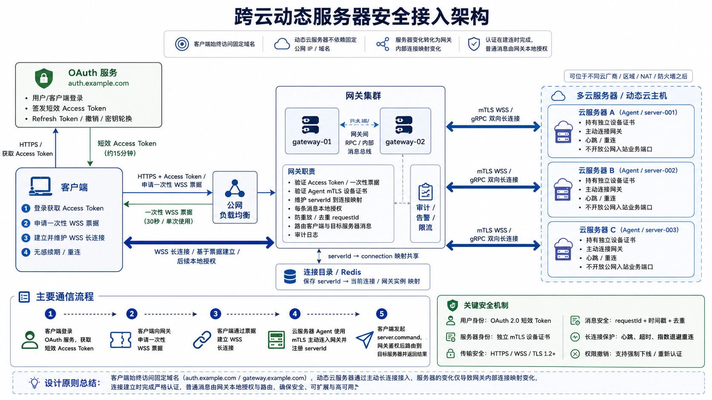

# 跨云动态服务器安全接入架构

## 1. 文档目的

本文总结客户端、OAuth 服务、连接网关与多个动态云服务器之间的安全通信方案。

目标场景如下：

- 多个业务服务器分布在不同云厂商、区域或网络；
- 服务器公网 IP 可能变化，且部分服务器可能位于 NAT 或防火墙之后；
- 不希望为每台服务器维护公网域名和 TLS 证书；
- 客户端需要与服务器进行实时、双向、长期通信；
- 通信内容需要保证机密性、完整性、身份真实性和权限可控性。

推荐方案是：

> 使用固定公网网关承接客户端连接，各云服务器主动连接网关；用户身份使用 OAuth 2.0 短效令牌，服务器身份使用独立 mTLS 设备证书，网关根据 `serverId` 在两类长连接之间进行安全路由。

## 2. 总体架构



```text
                         HTTPS
客户端 ─────────────────────────> OAuth服务
   │                              auth.example.com
   │        短效Access Token
   │<─────────────────────────────
   │
   │ HTTPS + Access Token
   │ 申请一次性WSS票据
   ▼
连接网关 / API Gateway
gateway.example.com
   ▲
   │ WSS + 一次性票据
   │
客户端
   │
   │          mTLS WSS/gRPC双向长连接
   ├────────────────────────── 云服务器A
   ├────────────────────────── 云服务器B
   └────────────────────────── 云服务器C
```

系统通常只需要两个稳定域名：

```text
auth.example.com       OAuth认证服务
gateway.example.com    HTTPS API与WSS连接网关
```

各云服务器不需要独立公网域名、固定公网 IP 或开放公网入站服务端口，只需要能够主动访问 `gateway.example.com:443`。

## 3. 核心组件职责

### 3.1 OAuth 服务

OAuth 服务负责用户和应用身份，不负责转发业务流量：

- 用户或客户端登录；
- 签发短效 Access Token；
- 在 Token 中提供用户、角色、受众和权限范围；
- 提供 Refresh Token、Token 撤销和密钥轮换能力；
- 在用户封禁或权限撤销时通知网关。

### 3.2 连接网关

连接网关是系统的统一公网入口和核心安全边界：

- 验证 OAuth Access Token 或一次性连接票据；
- 接受客户端 WSS 长连接；
- 验证云服务器的 mTLS 设备证书；
- 接受服务器 Agent 主动建立的长连接；
- 维护 `serverId → 当前连接` 的动态映射；
- 对每条消息进行本地授权、格式校验、限流和防重放检查；
- 在客户端连接和目标服务器连接之间路由消息；
- 记录连接和业务操作的审计日志。

### 3.3 云服务器 Agent

每台云服务器运行一个 Agent：

- 持有唯一的设备身份和独立 mTLS 客户端证书；
- 主动连接固定网关域名；
- 注册自身 `serverId` 和能力信息；
- 维持心跳并在断线后指数退避重连；
- 接收网关下发的命令并返回结果；
- 对高风险命令进行幂等与重复请求检查。

### 3.4 客户端

客户端负责：

- 通过 HTTPS 登录 OAuth 服务；
- 使用 Access Token 向网关申请一次性 WSS 票据；
- 建立并维护 WSS 长连接；
- 在认证即将过期时无感续期；
- 使用唯一 `requestId` 发送业务消息；
- 断线后指数退避重连，且不盲目重发非幂等命令。

## 4. 完整通信流程

### 4.1 获取短效 Access Token

客户端通过 HTTPS 访问 OAuth 服务：

```http
POST https://auth.example.com/oauth/token
```

OAuth 服务返回短效令牌，例如：

```json
{
  "access_token": "...",
  "expires_in": 900,
  "token_type": "Bearer"
}
```

Access Token 可设置为约 15 分钟有效，具体时间应根据风险和使用体验调整。

### 4.2 申请一次性 WSS 票据

客户端使用 Access Token 调用网关：

```http
POST https://gateway.example.com/v1/ws-ticket
Authorization: Bearer <access_token>
```

网关验证 Token 后返回：

```json
{
  "ticket": "single-use-random-ticket",
  "expiresIn": 30
}
```

票据应满足：

- 只能使用一次；
- 有效期很短，例如 30 秒；
- 绑定用户、客户端、用途和会话；
- 连接建立后立即失效。

不应直接把 OAuth Access Token 放入 WSS URL，因为 URL 可能进入代理、监控和访问日志。

### 4.3 建立客户端 WSS 长连接

```text
wss://gateway.example.com/client?ticket=<ticket>
```

WSS 建立后，网关创建已认证的连接会话：

```json
{
  "connectionId": "conn-123",
  "userId": "user-001",
  "roles": ["operator"],
  "scopes": ["server:read", "server:command"],
  "allowedServers": ["server-001", "server-002"],
  "authenticatedUntil": 1784045700
}
```

后续普通消息不需要再次携带 OAuth Token。

### 4.4 云服务器主动连接网关

每台服务器 Agent 主动连接：

```text
wss://gateway.example.com/agent
```

也可以使用 gRPC 双向流。连接使用 mTLS，网关根据客户端证书识别服务器：

```text
证书身份server-001 → gateway-01 / connection-A
证书身份server-002 → gateway-02 / connection-B
```

服务器 IP 发生变化时，Agent 重新连接即可，网关更新内部映射，无需修改 DNS。

### 4.5 消息路由

客户端通过现有 WSS 连接发送：

```json
{
  "type": "server.command",
  "requestId": "01JXYZ123",
  "serverId": "server-001",
  "command": "get_status",
  "timestamp": 1784044800,
  "payload": {}
}
```

网关依次执行：

1. 根据 WSS 连接找到当前用户会话；
2. 检查连接认证是否仍然有效；
3. 检查用户能否访问目标 `serverId`；
4. 检查用户能否执行指定 `command`；
5. 校验消息格式、大小、时间戳和频率；
6. 检查 `requestId` 是否重复；
7. 查找目标服务器当前所在的网关实例和连接；
8. 将消息转发至目标服务器；
9. 将执行结果返回客户端；
10. 写入安全审计日志。

## 5. 短效 Token 与长连接

短效 Token 和长连接并不冲突：

- Access Token 控制身份认证的有效周期；
- WSS 控制网络连接的生命周期；
- 认证到期时可以更新连接身份，不需要重建 WSS。

### 5.1 每条消息不重新访问 OAuth 服务

建立连接时验证一次 Token 并创建连接会话。后续每条消息只进行网关本地检查：

- 连接是否已认证；
- 会话是否过期；
- 用户是否可以访问目标服务器；
- 用户是否可以执行目标命令；
- 请求是否重复、过期或超限。

这些检查应通过内存权限信息、本地 JWT Claims 或短期权限缓存完成，不需要每条消息调用 OAuth 服务，也不需要重新进行 TLS 握手。

### 5.2 长连接无感续期

认证即将到期时，网关通知客户端：

```json
{
  "type": "auth.expiring",
  "expiresIn": 60
}
```

客户端通过 HTTPS 使用 Refresh Token 获取新的 Access Token，然后申请一次性续期票据：

```http
POST https://gateway.example.com/v1/ws-renew-ticket
Authorization: Bearer <new-access-token>
```

客户端通过现有 WSS 连接提交票据：

```json
{
  "type": "auth.refresh",
  "ticket": "<single-use-renew-ticket>"
}
```

网关验证后更新连接身份：

```json
{
  "type": "auth.refreshed",
  "authenticatedUntil": 1784046600
}
```

整个过程不需要断开 WSS，也不会影响服务器连接。

### 5.3 撤销和强制下线

OAuth 或权限服务应通过事件通知网关：

```json
{
  "type": "user.revoked",
  "userId": "user-001"
}
```

网关收到后清除权限缓存，并断开相关连接或要求其立即重新认证。这样既避免每条消息查询 OAuth 服务，也能及时撤销访问权限。

## 6. HTTPS、WSS 与 mTLS 的关系

```text
HTTPS = HTTP + TLS
WSS   = WebSocket + TLS
```

WSS 的加密强度并不天然高于 HTTPS。二者使用相同 TLS 配置时，传输层安全性基本相同。选择依据是通信模式：

| 协议 | 适用场景 |
|---|---|
| HTTPS | 登录、换取票据、配置、查询和普通请求响应 |
| WSS | 客户端实时双向通信、服务器主动推送 |
| mTLS WSS | Agent 需要较好兼容性和双向长连接 |
| mTLS gRPC 双向流 | Agent 技术栈统一、要求强类型协议和较高性能 |

TLS 能提供传输机密性、完整性和服务端身份验证，但不会自动解决业务授权、请求重放、终端被入侵或服务端数据泄露。因此仍需单独实现身份、权限和消息安全机制。

## 7. 身份与权限模型

系统应分离用户身份和服务器身份：

| 对象 | 认证方式 | 证明内容 |
|---|---|---|
| 用户或客户端 | OAuth 短效 Access Token | 谁在操作、具有哪些权限 |
| 云服务器 Agent | 独立 mTLS 设备证书 | 这是哪一台真实服务器 |

网关需要同时验证：

```text
用户user-001
  → 是否有权访问server-001
  → 是否有权执行restart命令
  → server-001是否由合法设备证书建立连接
```

每台服务器必须使用独立证书，禁止所有服务器共享同一个 API Key 或客户端证书。证书应支持独立签发、定期轮换、过期更新和单独吊销。

## 8. 必须落实的安全措施

### 8.1 传输安全

- 只允许 HTTPS、WSS 或其他基于 TLS 的协议；
- 公网入口原则上只开放 `443`；
- 使用 TLS 1.2 或 TLS 1.3；
- 禁止跳过服务端证书验证；
- Agent 到网关使用 mTLS；
- 私钥存放在操作系统证书库、密钥管理服务或安全硬件中；
- 禁止把 Token、票据和私钥写入普通日志。

### 8.2 消息级授权

不能只在连接建立时检查一次权限。每条业务消息都必须在网关本地验证：

- 当前连接是否仍然有效；
- 用户是否有权访问该 `serverId`；
- 用户是否有权执行该 `command`；
- Agent 是否有权声明该 `serverId`；
- 消息是否符合预定义协议。

### 8.3 防重放和幂等

每个请求应包含全局唯一 `requestId` 和时间戳。网关及 Agent 应：

- 拒绝超出允许时间窗口的请求；
- 记录近期处理过的 `requestId`；
- 拒绝重复请求或返回之前的执行结果；
- 对交易、删除、重启等高风险命令实现幂等控制；
- 不因网络重连而自动重复执行非幂等命令。

### 8.4 长连接保护

- 使用 Ping/Pong 或应用心跳检测失效连接；
- 使用带抖动的指数退避策略重连；
- 设置连接空闲超时和最大生存时间；
- 限制单连接消息速率、并发请求数和消息大小；
- 对消息类型、字段和业务状态进行白名单校验；
- 权限撤销后主动断开连接；
- 对连接、续期、断开和敏感操作记录审计日志。

## 9. 网关高可用与扩展

网关是核心安全边界和潜在性能瓶颈，生产环境不应部署为单实例：

```text
                    ┌── gateway-01
公网负载均衡 ───────┤
                    └── gateway-02
```

长连接属于具体网关实例，因此需要共享连接目录：

```text
server-001 → gateway-01 / connection-A
server-002 → gateway-02 / connection-B
```

可使用 Redis 等组件保存服务器当前连接在哪个网关实例。若客户端连接与目标服务器连接不在同一实例，可通过网关间 RPC 或内部消息总线转发。

故障处理要求：

- 负载均衡器自动摘除异常网关；
- 客户端与 Agent 自动连接到健康实例；
- 使用 `requestId` 避免故障切换期间重复执行；
- 连接目录具有过期机制，避免保留僵尸映射；
- 网关尽量保持业务无状态，连接状态可重建。

## 10. 推荐参数基线

以下数值仅作为初始参考，应通过安全评估和压测调整：

| 项目 | 建议初始值 |
|---|---|
| Access Token 有效期 | 15 分钟 |
| WSS 建连票据有效期 | 30 秒 |
| 票据使用次数 | 1 次 |
| 认证到期提醒 | 提前 60 秒 |
| 心跳间隔 | 20～30 秒 |
| 心跳超时 | 连续 2～3 次未响应 |
| 重连方式 | 指数退避并加入随机抖动 |
| 请求去重窗口 | 根据最长业务执行时间确定 |

## 11. 最终结论

本场景的推荐架构为：

```text
OAuth服务
  └── 管理用户、应用和短期访问权限

客户端
  ├── HTTPS获取OAuth Access Token
  ├── HTTPS换取一次性WSS票据
  ├── WSS连接网关
  └── 通过现有连接无感续期

云服务器Agent
  ├── 持有独立设备证书
  ├── 主动建立mTLS长连接
  ├── 自动心跳和重连
  └── 不开放公网入站业务端口

网关集群
  ├── 验证OAuth身份与设备证书
  ├── 维护serverId到连接的映射
  ├── 对每条消息进行本地授权和防重放检查
  ├── 在客户端与服务器之间路由消息
  └── 提供限流、审计、告警和高可用能力
```

核心原则是：

> 不把动态云服务器的变化转换为 DNS 变化，而是转换为网关内部的长连接和路由映射变化。客户端始终访问固定域名，云服务器主动连接网关；建立连接时认证，普通消息本地授权，认证到期时在原长连接上无感续期。
