# SC 证券股票交易系统：三端功能说明

> 生产维护版：2026-08-10
>
> 本文从维护者角度说明 Client、SM、TS 的功能入口、职责和典型操作流。SM 界面截图使用独立演示数据，账号、域名、IP、凭据和软件校验值均已脱敏或虚构。

## 1. Client 功能

### 1.1 登录和连接

Client 登录页只负责系统账号登录。输入交易员账号和密码后，Client 请求 SM `/auth/login`，取得 Client token、有效期和绑定 TS 地址；随后通过绑定地址建立 WSS。Client 不提供券商登录框，也不保存 TT 或 IB 凭据。

典型流程：

1. 启动 Client。
2. 输入由 SM 管理的交易员账号和密码。
3. SM 返回绑定 TS 地址和 24 小时 Client token。
4. Client 连接 TS WSS，并完成 Token、节点绑定和连接会话校验。
5. 收到 `CONNECT_ACK` 后进入主界面。

认证失效时，Client 应在密码输入区域下方显示居中的弱提示，并回到登录页。提示内容面向交易员，例如“认证已过期，请重新登录”，不显示 traceback、TS IP 或券商 SDK 异常。

### 1.2 主界面交易栏

主界面包含左右两个独立交易栏。当前选中的交易栏是后续输入、报价、快捷下单和持仓双击加载的目标栏。

交易栏的核心工作流：

1. 在 `SYMBOL` 输入框输入美股代码。
2. 点击查询按钮或按回车，触发行情订阅/查询。
3. 报价返回后显示 `BID` 和 `ASK`；主界面不显示 `LAST`。
4. 用户在当前选中交易栏设置方向、股数、价格、订单类型、TIF、Route 和 Hide。
5. 点击 `BUY` 或 `SELL`，或使用已启用的下单快捷键提交订单。

输入代码不再因为等待 350ms 自动加载报价；查询动作是显式点击或回车。持仓条目需要双击才加载到当前选中的交易栏，右侧交易栏选中时也必须加载到右侧。快捷下单同样以当前选中交易栏为目标。

界面字段职责：

| 字段 | 作用 |
|---|---|
| `SYMBOL` | 当前交易标的；报价和后续订单围绕已确认的标的执行 |
| `BID` / `ASK` | 当前报价；下单价格策略由订单类型、方向和 TIF 决定 |
| `QTY` | 订单数量；保留手动输入，股数快捷键可填充数量 |
| `TYPE` | `LMT` 或 `MKT` |
| `TIF` | `DAY`、`GTC`、`IOC`、`EXT`、`GTC_EXT` |
| `ROUTE` | 主交易栏按券商能力处理；TT 固定 SMART 且主界面禁止修改，IB 可按 capability 选择 |
| `HIDE` | 隐藏订单参数；不支持该参数的券商允许保存配置但执行时按普通订单处理，界面以能力状态置灰或说明 |

### 1.3 订单类型和 TIF

| Client 选项 | 统一含义 | 典型用途 |
|---|---|---|
| `DAY` | 当日有效，常规时段使用 | 价格确认后挂单 |
| `GTC` | 撤销前持续有效，具体期限受券商规则约束 | 不要求当日结束失效的限价单 |
| `IOC` | 立即成交或取消，未立即成交部分取消 | 强时效提交；应减少本地等待 |
| `EXT` | 映射为 DAY + 盘前盘后标记 | 扩展时段限价单 |
| `GTC_EXT` | 映射为 GTC + 盘前盘后标记 | 允许时延续到后续时段 |

方向映射统一为：Buy to Open/Close -> `BUY`，Sell to Open/Close -> `SELL`。普通限价买入和卖出使用当前界面价格策略；IOC 应优先让券商在提交时执行其即时性规则，仍需满足券商对行情、价格精度和时段的限制。

### 1.4 持仓栏

持仓栏通过 `POSITION_QUERY` 从 TS 请求绑定账户的持仓。维护者排查时应区分：

- TS WSS 已连接但券商 Session 离线。
- 账户没有持仓。
- 账户有持仓但当前券商权限或接口不支持查询。
- 返回成功但界面数据尚未刷新。

持仓条目双击加载代码和报价，不改变用户当前选中的交易栏目标。

### 1.5 订单栏

订单栏包含四个页签：

| 页签 | 第一版含义 |
|---|---|
| `进行中` | 当前仍可被市场接受、等待交易或正在处理的订单；至少覆盖 live/received/routing 等活动状态 |
| `成交` | 已成功成交的订单或成交记录 |
| `失效` | 已取消、拒绝或已无法继续交易的订单 |
| `ALL` | 当前适配器可提供的全部订单范围 |

订单状态最终由券商适配器归一化。订单发生提交、成交、取消或拒绝时，TS 可以通过订单事件回调触发刷新；Client 仍保留显式刷新入口作为恢复手段。TT 和 IB 的“全部订单”范围不同：TT 按当前账户范围展示，IB 第一版以当前 TS 创建/维护的订单范围为准。

撤单规则：已成交、已取消、已拒绝等不可撤销状态不可调用撤单接口。`Esc` 是当前选中交易栏股票的批量活动订单撤销，不是全局撤单；后续控制台和订单成功/失败提示会接入统一弱提示区域。

### 1.6 美股交易日和时区

Client 的“当日活动”统计使用 `America/New_York` 时区，不使用 Windows 本地时区，也不以北京时间 00:00 作为交易日边界。当前代码按美东时间 04:00 至 20:00 作为美股活动窗口，并将订单时间、成交时间转换到美东时间后再判断是否属于当日。

因此，美股一个交易日可能跨越北京时间的 21:30 到次日 03:30，跨过中国零点不会自动把它拆成两个交易日。夏令时切换时，北京时间对应的开盘和收盘时刻会变化，维护者应以美东时间和券商返回的带时区时间为准。

这里需要区分两个概念：

- 订单栏的 `进行中`、`成交`、`失效`、`ALL` 由订单查询和订单状态归类决定，不等同于持仓栏“当日活动”统计。
- 持仓栏中的成交数量和当日盈亏会使用上述美东时间窗口筛选成交记录；如果券商返回的时间没有时区，系统会按统一规则补齐后再转换。

### 1.7 快捷键和本地配置

快捷键设置内部分为三个页签：

1. 股数快捷键：默认保留小键盘 `Num+1` 到 `Num+9`，按键固定、数值可改；允许新增规则，最多 20 条，新增规则可修改按键。每条有 `启用`。
2. 下单快捷键：最多 15 条，自由新增和修改；支持方向、类型、TIF、Route、价格偏移、Hide 和启用状态。配置页允许保存当前券商不支持的 Route/Hide；执行时由能力门控回落到默认 Route 或普通订单。
3. 固定快捷键：只读，包含面板切换、当前股票活动订单撤销、价格调整和 Enter 查询/确认等固定行为。

默认股数快捷键 `Num+1` 到 `Num+9` 启用，默认下单快捷键 `Shift+F1` 到 `Shift+F12` 禁用。配置保存前执行字段校验、启用规则空按键检查和冲突检测；保存失败时应使用安全、简短的用户文案，不暴露内部异常文本。

运行时默认配置在代码中的 `Client/ui_qt/hotkey_config.py`，用户配置使用生产用户数据目录的 `hotkey.json`。当前实现优先读取本地配置；文件不存在、解析失败或校验失败时回退默认配置，并保留后续需要补充的用户提示/日志策略。

### 1.8 Client 界面截图

以下截图由当前 Client 的真实 PySide6 界面使用脱敏演示数据采集。图中不包含真实账号、密码、域名、IP、Token、订单号或券商凭据；订单、行情、持仓和日志内容仅用于说明界面结构与功能入口。

#### 登录页

Client 登录页只收集系统账号和密码。认证过期或认证失效时，登录页在密码输入区域下方显示面向交易员的弱提示，不展示 TS 地址、券商名称或底层异常。

<figure class="product-docs-screenshot-figure">

<figcaption>Client 登录页：账号密码输入和认证失效弱提示。</figcaption>
</figure>

#### 主交易界面

主界面由顶部连接状态与操作区、左右交易栏、订单面板、持仓与盈亏面板以及控制台组成。交易栏展示标的、BID/ASK、订单类型、Route、TIF、数量、价格和买卖按钮；下方区域用于查看订单、持仓和安全提示日志。

<figure class="product-docs-screenshot-figure">
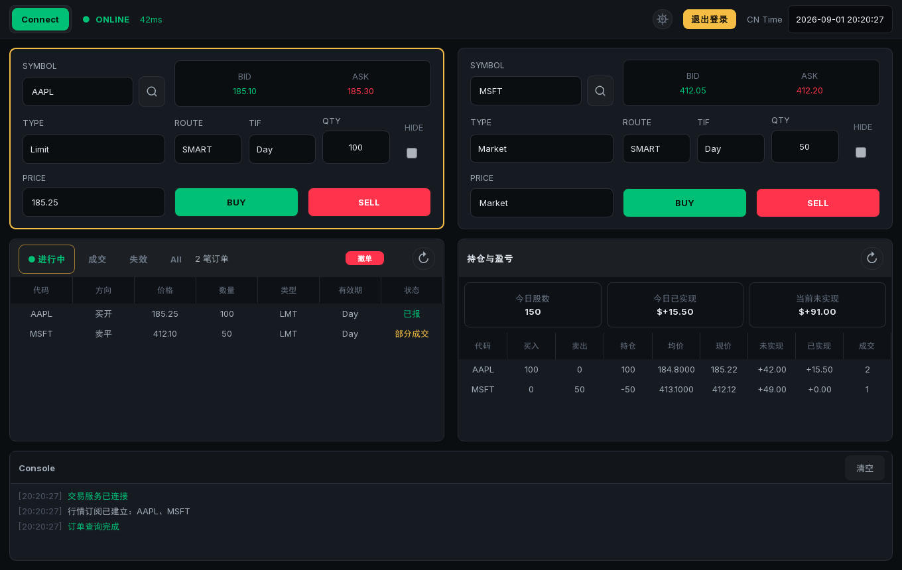
<figcaption>Client 主交易界面：双交易栏、报价、订单、持仓与控制台。</figcaption>
</figure>

#### 股数快捷键

股数快捷键页签保留 `Num+1` 到 `Num+9` 的固定按键，数量可以修改，每条规则有启用状态；自定义规则可以继续添加，最多 20 条。

<figure class="product-docs-screenshot-figure">
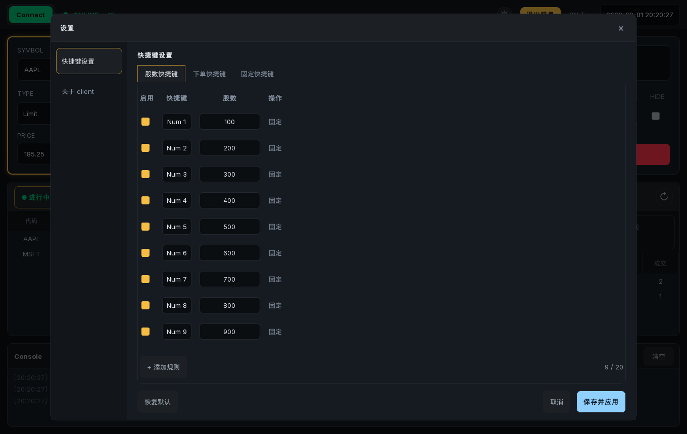
<figcaption>快捷键设置-股数快捷键：固定小键盘按键、数量与启用状态。</figcaption>
</figure>

#### 下单快捷键

下单快捷键页签支持方向、TYPE、TIF、Route、价格偏移、价格来源、快速下单、HIDE 和启用状态。图中可以看到价格来源的 BID/ASK 选择，以及 IOC 规则下快速下单项被置灰；当前通道不支持的 Route/HIDE 也会按能力门控显示为不可用。

<figure class="product-docs-screenshot-figure">
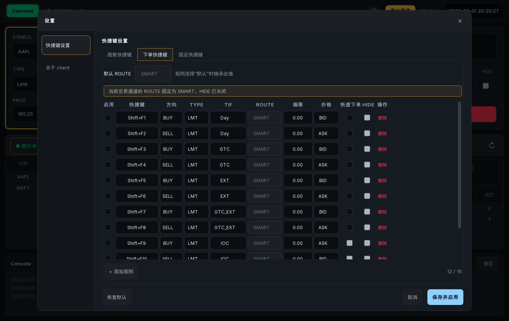
<figcaption>快捷键设置-下单快捷键：价格来源、快速下单及通道能力置灰状态。</figcaption>
</figure>

#### 固定快捷键

固定快捷键页签只读展示面板切换、输入确认、价格调整等固定行为，避免交易员误以为这些系统级快捷键可以被删除或改写。

<figure class="product-docs-screenshot-figure">
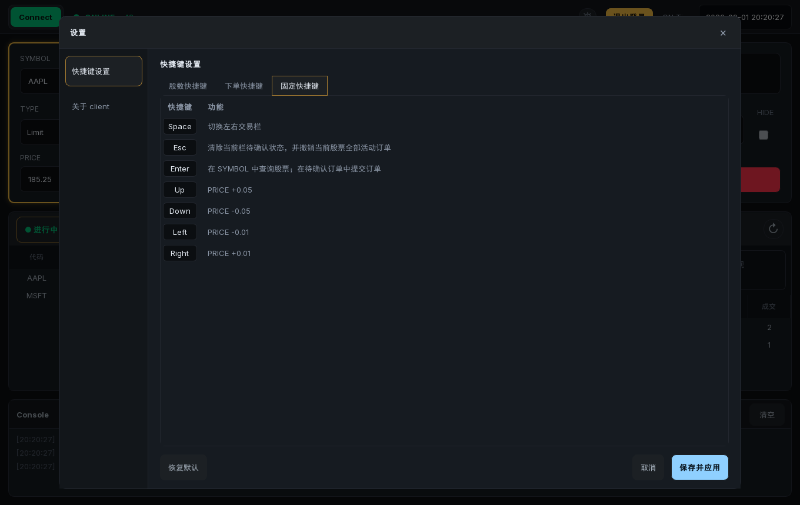
<figcaption>快捷键设置-固定快捷键：固定行为及其功能说明。</figcaption>
</figure>

## 2. SM 功能

### 2.1 管理员登录和权限

SM Web 管理后台使用管理员会话 Cookie。会话存储在 SM 内存中，SM 重启后会失效，需要重新登录。当前代码区分普通管理员和 `super_admin`；高权限操作应通过服务端会话权限校验，不能只依赖前端按钮隐藏。

生产部署时通过环境变量注入 bootstrap 管理员配置，不应把实际生产密码写入文档、Git 或截图。首次进入后台后应按照组织安全规范设置并保存唯一的强密码。

产品文档、账户管理、TS 节点管理、子域名池和日志信息面向已登录管理员开放；资金总览和 DNS 设置属于超级管理员专属功能。权限限制以服务端会话为准，页面隐藏只用于改善操作体验。

### 2.2 总览大盘

总览大盘用于快速判断当前 SM、交易账户和 TS 节点的运行范围，不替代节点详情或券商运行日志。页面包含以下信息：

- 统计卡片：交易账户总数、可使用交易账户数、TS 节点总数和运行中的节点数。
- 账户状态分布：展示账户名称、账户券商、绑定 TS 节点和账户状态，并可跳转到账户管理查看全部账户。
- 节点状态：展示节点名称、配置券商、主机地址和节点状态，并可跳转到 TS 节点管理。
- 最近事件：显示最近的 SM 操作审计事件；支持刷新并进入日志信息查看分页结果。

总览数据由账户列表、节点列表、系统健康和最近审计接口组合而成。统计卡片和列表反映最近一次刷新结果，排查实时连接时仍应以节点心跳、占用关系和 TS 状态为准。

### 2.3 交易员账号

SM 负责创建、激活、停用和绑定交易员账号。Client 登录只验证 SM 数据库账号；账号的 TS 绑定决定 Client 后续可连接的节点。SM 还负责节点占用关系、Token 复验和异常释放。

账户管理包含“账户状态”和“注册账户”两个页签。注册表单字段包括用户名、密码、角色、券商、TS 地址和描述：

- 交易员必须填写券商和 TS 地址；TS 地址可以从已分配的域名中选择，也可以手工输入完整 WSS URL 或 IP:端口。
- 管理员账户不绑定券商和 TS，相关字段在选择管理员角色后禁用并清空。
- 超级管理员可以创建和管理管理员、交易员；普通管理员只能创建和管理交易员，管理员账户对普通管理员只读。

账户状态列表显示可使用、使用中、暂停使用等状态，并提供详情、编辑、暂停、恢复和删除操作。暂停账户、删除账户、修改密码或修改 TS/券商绑定后，已有 Client Token 不应继续用于建立交易会话；占用节点的连接需要按服务端释放流程处理。删除账户是不可恢复操作，执行前应确认账户和当前占用关系。

### 2.4 TS 节点注册审批

SM 待审批列表显示 TS 注册请求。管理员打开审批弹窗后：

- TT：SM 直接验证 TT 凭据和账户信息。
- IB：SM 调用待审批 TS 的验证接口，由 TS 在本机连接 Gateway 获取 `managedAccounts`；SM 展示列表，管理员必须选择一个 `account_id`。

审批通过后，SM 保存节点的 broker config、绑定账户和节点 token，并返回配置给 TS。一个 TS 不同时绑定多个 IB 账户，也不提供同一节点 TT/IB 运行时切换。

节点管理包含“节点状态”和“注册审核”两个页签。节点状态页提供详情、配置、重载、暂停、恢复、删除和解除占用等操作；注册审核页用于处理待审批节点。审批前应核对节点名称、券商能力、主机/公网 IP、来源 IP、注册时间以及 TT 凭据或 IB 账户选择结果。

强制解除占用会调用 TS 管理接口断开当前 Client，再释放 SM 中的节点占用状态。节点删除还会尝试释放关联域名；如果 DNS 释放失败，节点虽然可以删除，但域名仍需到子域名池继续处理。暂停、删除或强制释放正在使用的节点会中断对应交易员的 Client 连接，属于影响在线交易会话的运维操作。

### 2.5 域名池和 DNSPod

域名池导入完整 FQDN；审批成功时分配未占用域名，调用 DNSPod upsert A 记录指向 TS 上报的公网 IP。SM 保存域名占用、DNS record id、DNS 状态和节点关系。IP 变化时，后续应通过节点刷新/更新流程修改 A 记录；真实生产环境上线前仍需人工核对 DNS 结果。

子域名池包含“域名状态”“导入域名”和“DNS 设置”三个页签，其中 DNS 设置仅超级管理员可见。域名状态包括：

- `available`：可分配。
- `allocating`：正在分配。
- `occupied`：已绑定 TS 节点。
- `cooling`：释放后的冷却状态。
- `deleting`：正在删除。
- `error`：DNS 或域名处理异常。

导入支持逗号或换行分隔的批量 FQDN，单次最多 200 条。页面支持分页、刷新 DNS、恢复孤立域名和删除域名。已分配域名不能直接删除，应先删除关联 TS 节点；使用 MANUAL DNS 模式时，SM 删除记录后仍需人工清理 DNS 服务商中的 DNS 记录。

### 2.6 节点状态和心跳

SM 通过 TS 的 `POST /nodes/heartbeat` 接收节点心跳，并在内存中维护实时状态。心跳不仅用于展示在线状态，也用于清理失效节点占用，避免 Client 异常断开后节点永久锁定。

当前关键参数：

| 场景 | 心跳/检查行为 | 维护含义 |
|---|---|---|
| 空闲节点 | TS 默认约每 20 秒发送一次心跳 | 节点正常但没有 Client 占用 |
| Client 占用节点 | SM 返回约 5 秒下一次心跳 | 加快交易会话掉线检测 |
| 空闲节点超时 | 60 秒没有新鲜心跳 | SM 可标记 offline |
| 占用节点超时 | 15 秒没有新鲜心跳 | SM 标记 offline 并释放占用 |
| 占用切换窗口 | 占用后的前 30 秒允许 TS 切换到快速心跳 | 避免刚占用时因旧心跳间隔误释放 |
| WSS 鉴权确认窗口 | Client 占用后约 30 秒内需完成连接确认 | 只完成 SM 占用、不完成 WSS 鉴权时会释放预占用 |
| SM 巡检 | 约每 5 秒检查节点 | 必要时主动探活接近超时的占用节点 |

节点状态接口和管理列表可能出现 `approved`、`online`、`occupied`、`offline`、`suspended`、`degraded`。其中 `degraded` 表示节点在线但券商服务或关键能力异常，不能仅按在线状态判断可以正常交易。

节点展示状态优先级为：`suspended` > `offline` > `occupied` > `online/approved`。其中 `occupied` 只有节点实际在线时才成立。Client 占用属于进程内易失状态，SM 重启后不会恢复旧的 Client 占用快照；维护者重启 SM 后应让 Client 重新登录并重新建立占用。

节点被标记 offline 或 suspended 时，Client 可能无法新建 WSS；管理员强制释放节点时，TS 会向当前 Client 发送 `FORCE_DISCONNECT`。处理占用问题时，先确认节点心跳时间、real status、occupied_by 和 connection_id，再决定是否释放，不要直接删除数据库记录。

### 2.7 资金总览

资金总览仅超级管理员可访问。页面按美东交易日和 USD 汇总，支持开始日期、结束日期和券商账号筛选；当前仅统计股票实际成交资金流，不纳入出入金、股息、利息和非股票交易。

页面包含以下页签：

- 总览：账户净值趋势、买卖资金趋势和账号资金摘要。
- 交易资金流：每日买入、卖出、费用、交易净流入和数据完整度。
- 盈亏：每日已实现盈亏、账号已实现/未实现盈亏和权益变化。
- 账号交易：按账号查看每日实际成交。
- 标的统计：按标的查看买卖数量、金额、净流入、成交次数和账号数。
- 采集状态：查看首次采集、最后成功、范围完整度、当前状态和原因。
- 数据管理：预览并删除指定美东时间范围和账号的数据。

系统默认保留三个自然月数据，支持管理员发起立即采集；采集会优先使用可用节点，并在交易繁忙时让行。数据删除必须先预览影响并通过 CSRF 校验；删除会形成永久数据断点，后续采集和日终复核不会重新写入已删除的账号与时间范围。

### 2.8 日志信息

日志信息页面显示最近 7 天的 SM 管理员操作审计日志，支持分页和刷新；总览大盘的“最近事件”只展示最近事件摘要。日志内容用于追踪账户、节点、域名、配置和软件管理操作。

维护排查时应区分三类日志：管理员操作审计日志、SM 系统错误日志、TS/券商运行日志。当前日志信息页面不是完整的 TS 或券商日志查看器；涉及 WSS、心跳、券商 Session、Gateway 或 SDK 的问题，应继续到对应 TS 主机读取运行日志，并结合节点状态判断。

### 2.9 软件中心

软件中心用于管理员维护 Client 和 TS 的发布文件，页面支持 Client/TS 类型切换。上传的安装器或压缩包先进入草稿，管理员确认文件、版本和 SHA256 后再上架。

发布管理支持上架、下架、交易员可见性、默认版本、版本删除和文件替换：

- Client 发布后可以设置为交易员可见；默认版本只能从已发布且对交易员可见的 Client 版本中选择。
- 发布新的默认 Client 版本后，旧默认版本会归档；下架、隐藏或删除前应确认当前下载入口是否仍依赖该版本。
- 文件替换会产生新的修订记录；同一版本和文件类型存在冲突时，需要确认后替换。
- 下载响应提供 SHA256，发布前应核对安装器和压缩包的校验值。
- 已上架、交易员可见或默认版本存在保护限制，不能按普通草稿直接删除。

### 2.10 SM 界面截图（脱敏演示）

以下截图使用独立演示数据库和本地 Headless Chrome 采集，页面操作经过真实 SM Web 菜单、页签和审批弹窗；不代表生产数据或生产状态。

#### 管理员登录

<figure class="product-docs-screenshot-figure">
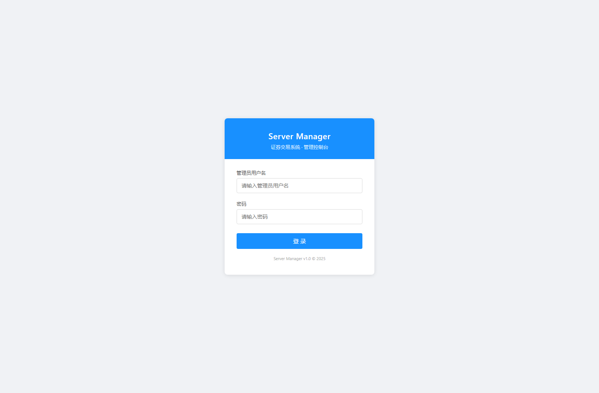
<figcaption>SM 管理员登录页。截图不包含实际账号或密码。</figcaption>
</figure>

#### 总览大盘

<figure class="product-docs-screenshot-figure">
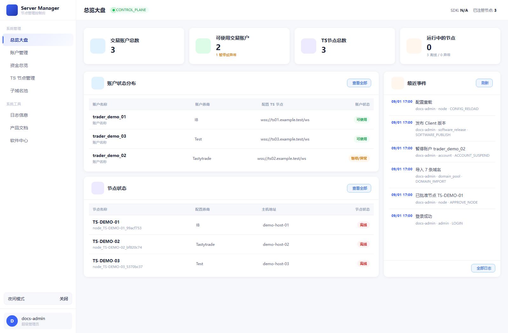
<figcaption>总览大盘：交易账户、TS 节点和最近审计事件。</figcaption>
</figure>

#### 交易员账户

<figure class="product-docs-screenshot-figure">
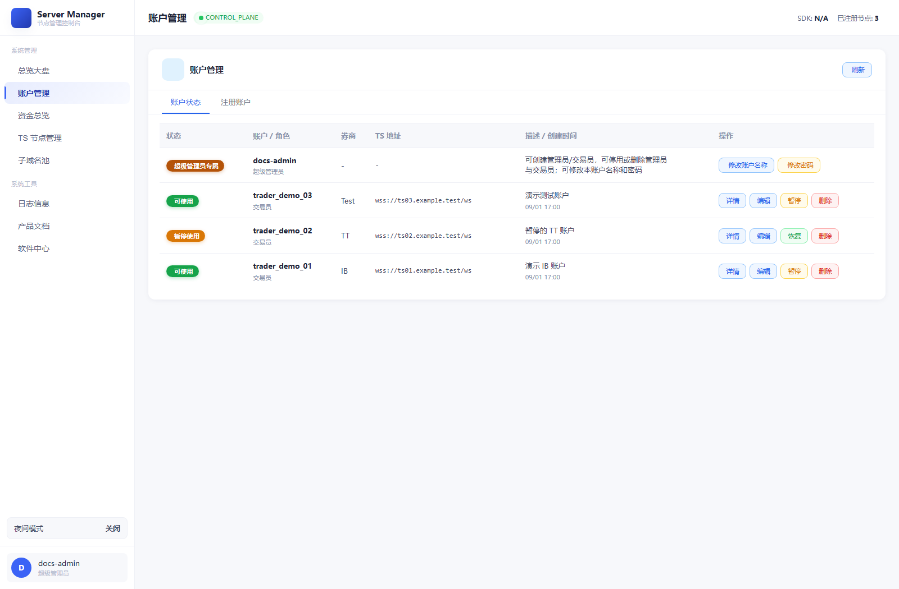
<figcaption>账户状态页：账户角色、券商标识、TS 地址和可用状态。</figcaption>
</figure>

<figure class="product-docs-screenshot-figure">
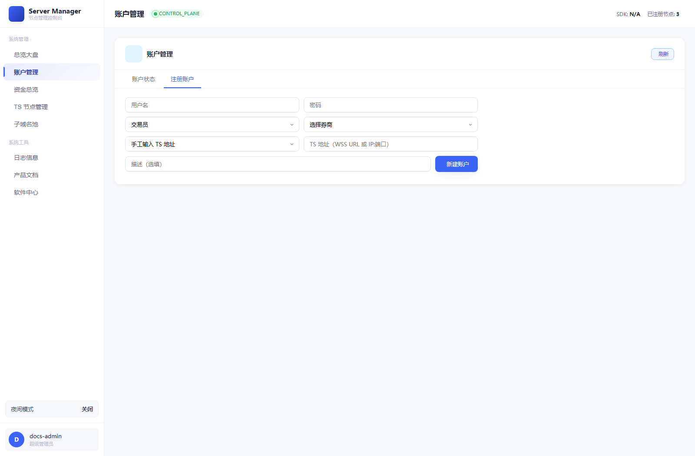
<figcaption>注册账户页：交易员账号、券商和 TS 地址配置入口。</figcaption>
</figure>

#### TS 节点与注册审批

<figure class="product-docs-screenshot-figure">
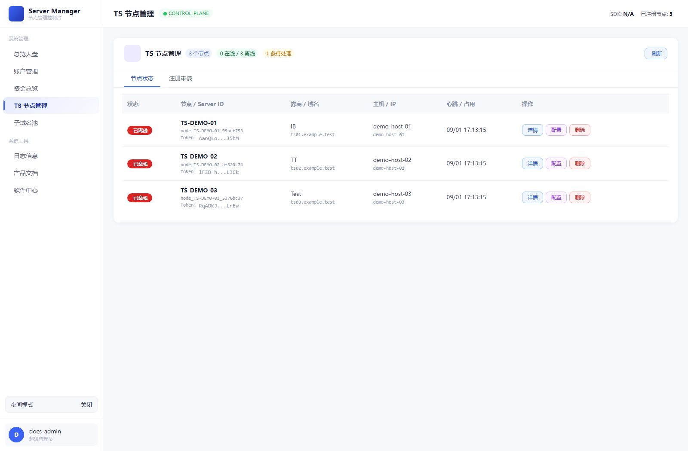
<figcaption>TS 节点状态页：节点状态、券商、域名、主机和运维操作。</figcaption>
</figure>

<figure class="product-docs-screenshot-figure">
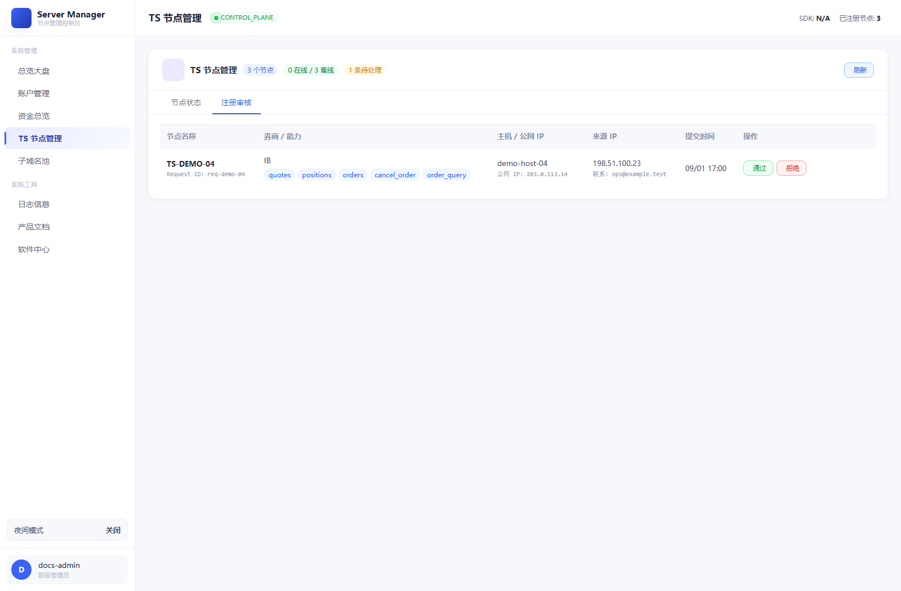
<figcaption>TS 注册审核页：待审批节点的能力、地址和来源信息。</figcaption>
</figure>

<figure class="product-docs-screenshot-figure">
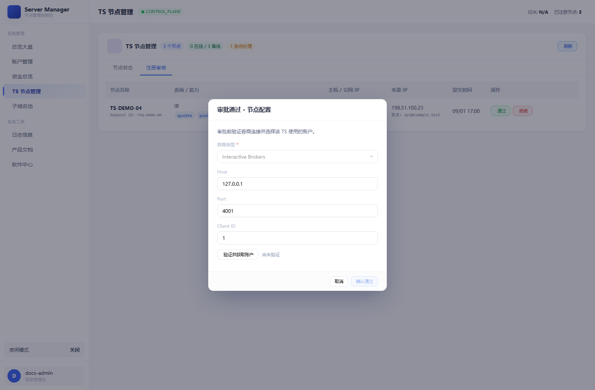
<figcaption>IB 节点审批配置弹窗：审批前验证 Gateway 并选择 TS 使用的账户。</figcaption>
</figure>

#### 子域名池与 DNS

<figure class="product-docs-screenshot-figure">
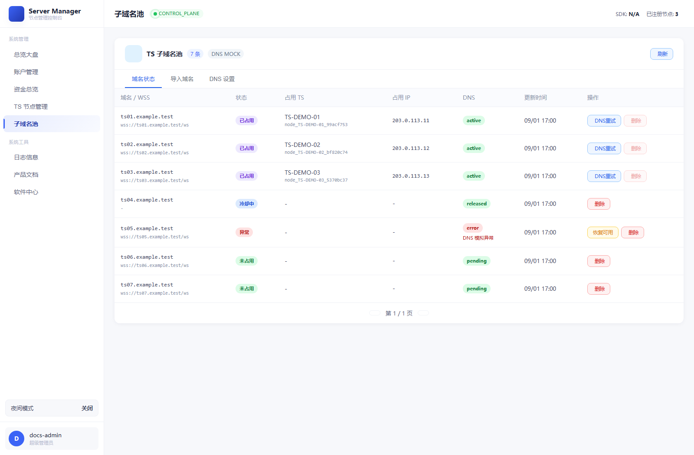
<figcaption>子域名池状态页：域名占用、DNS 状态和关联节点。</figcaption>
</figure>

<figure class="product-docs-screenshot-figure">
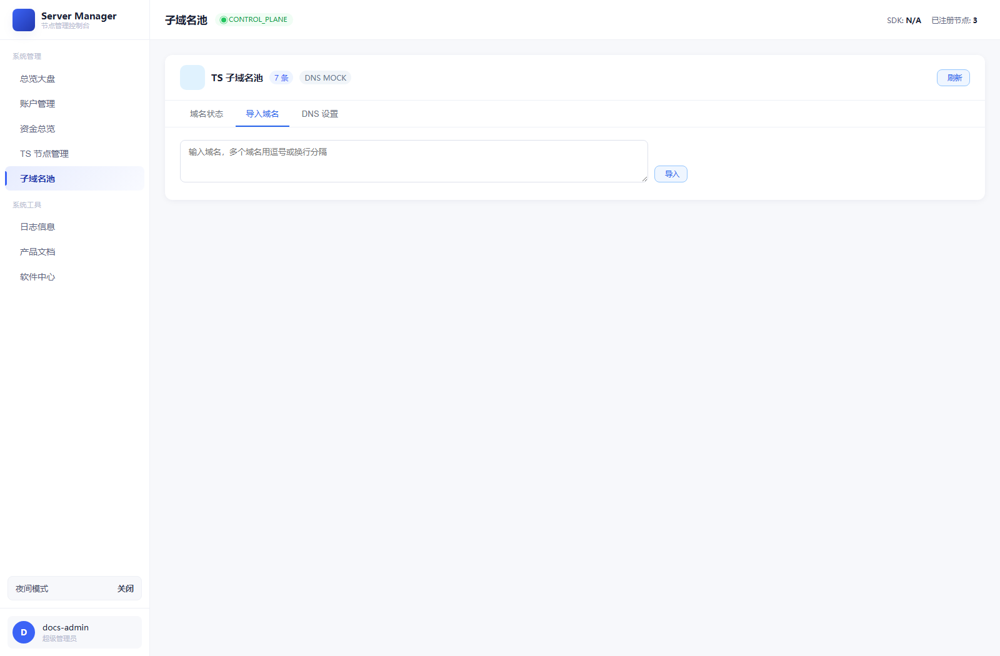
<figcaption>导入域名页：批量导入完整 FQDN。</figcaption>
</figure>

<figure class="product-docs-screenshot-figure">
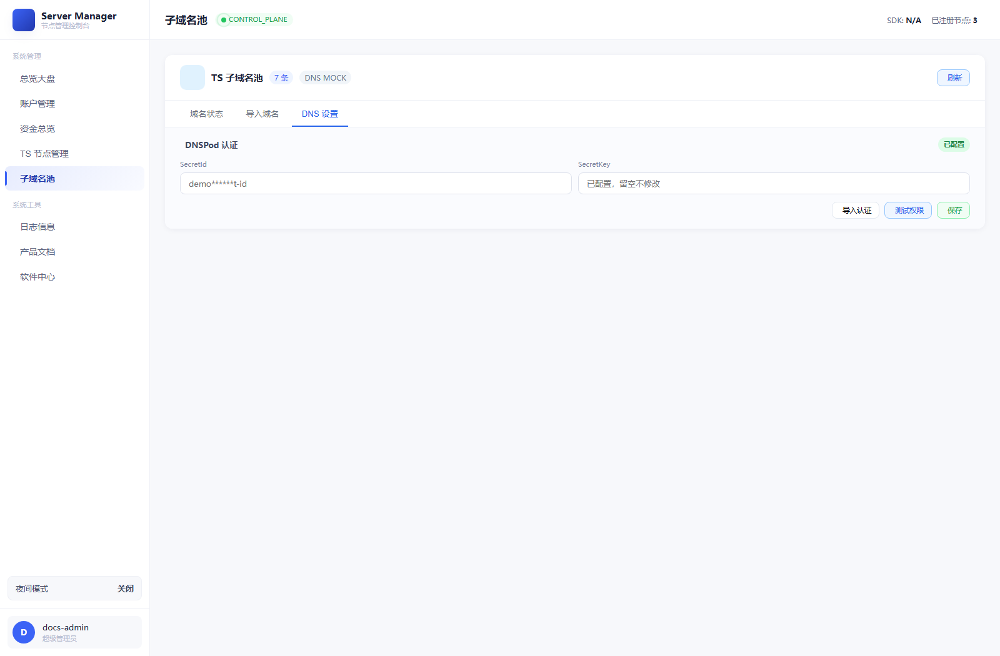
<figcaption>DNS 设置页：DNSPod 认证状态和权限测试入口，密钥内容不展示。</figcaption>
</figure>

#### 资金、日志与软件中心

<figure class="product-docs-screenshot-figure">
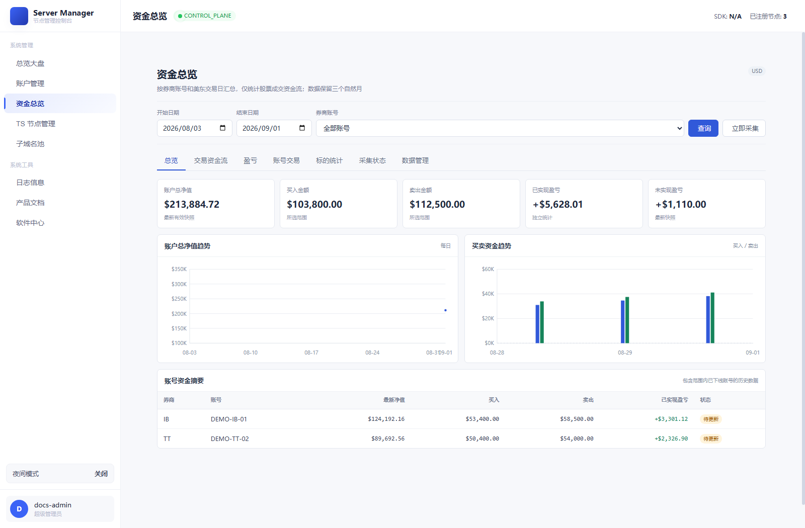
<figcaption>资金总览：按美东交易日汇总的合成资金数据。</figcaption>
</figure>

<figure class="product-docs-screenshot-figure">
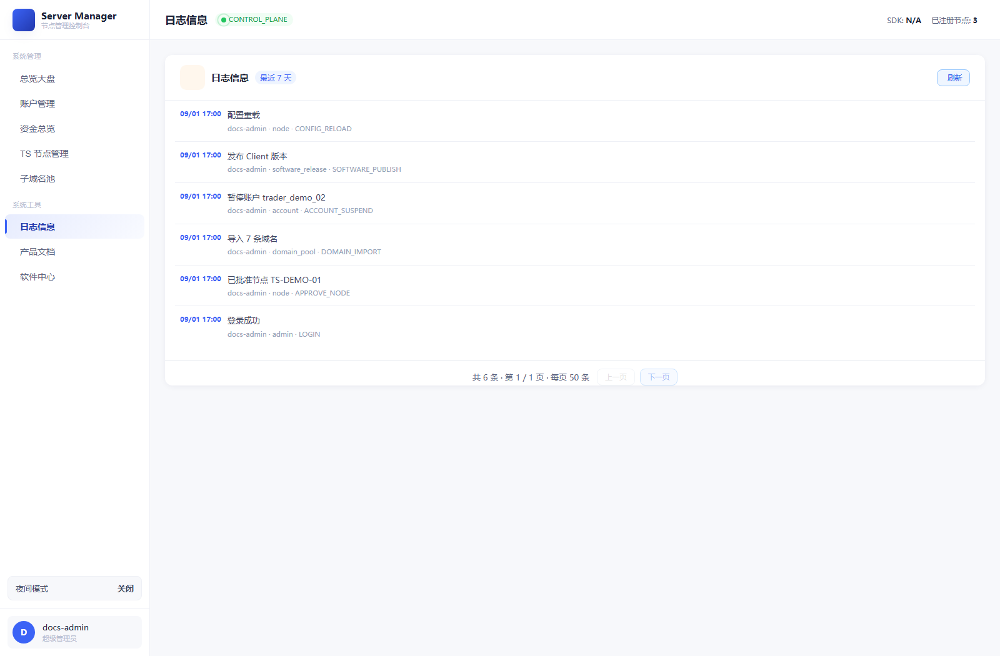
<figcaption>日志信息：管理员操作审计日志和分页入口。</figcaption>
</figure>

<figure class="product-docs-screenshot-figure">
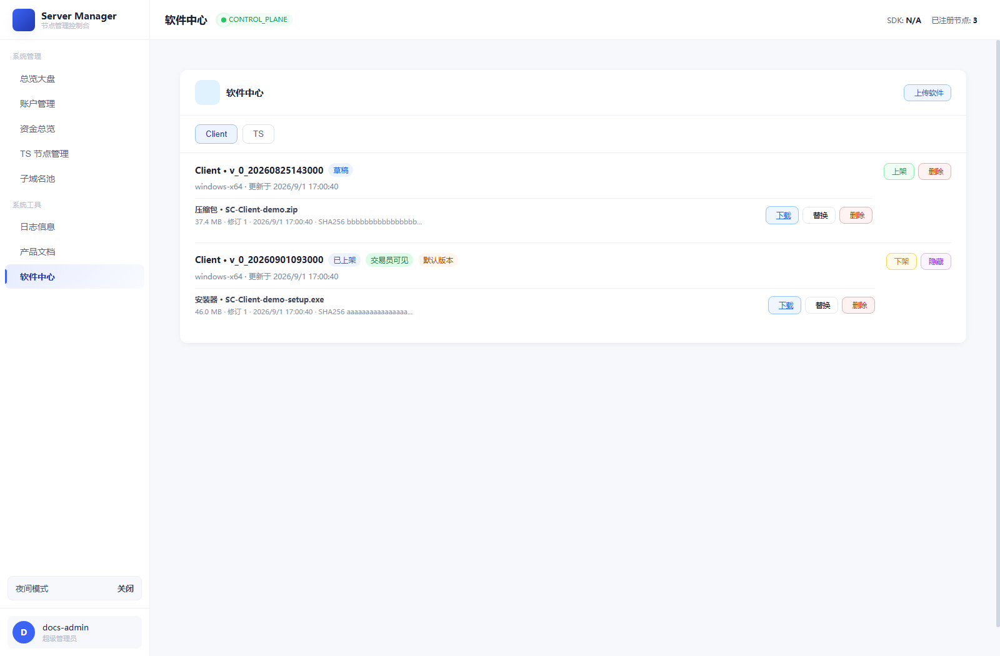
<figcaption>软件中心 Client 页：版本、发布状态、可见性和文件校验值。</figcaption>
</figure>

<figure class="product-docs-screenshot-figure">
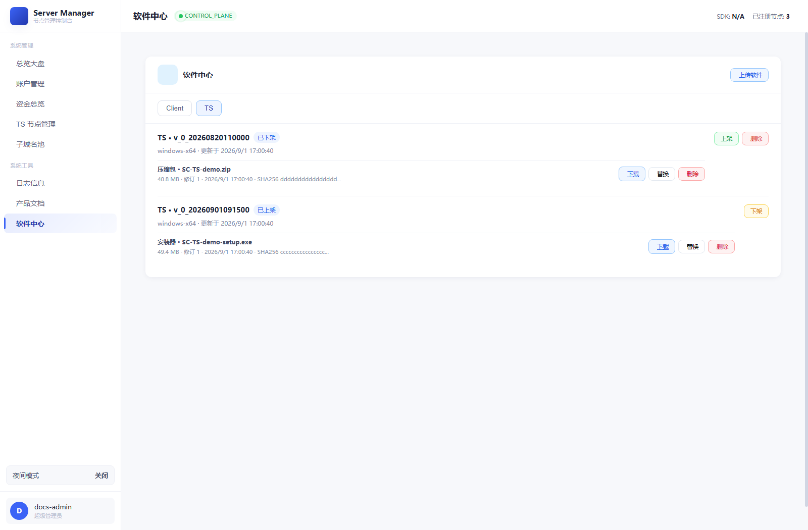
<figcaption>软件中心 TS 页：TS 安装器和压缩包版本管理。</figcaption>
</figure>

## 3. TS 功能

### 3.1 注册和配置同步

TS 启动后可通过注册 API 检查 SM、提交注册请求、等待 SSE 审批结果。`.register_state.json` 用于恢复等待中的注册状态；审批成功后，TS 保存节点配置并从 SM 拉取 broker config。已批准节点在后续启动中按配置初始化券商适配器和 Caddy。

### 3.2 WSS 网关

TS 的 WebSocket 首包完成 Client 认证；每条业务消息由 TS 根据当前 session、节点占用、券商连接状态和 capability 决定是否执行。Client 与券商 SDK 解耦，TS 是唯一的交易 API 适配边界。

### 3.3 配置同步和券商热重载

TS 的券商配置同步有三个触发来源：

1. 审批通过后的初始配置加载。
2. TS 心跳发现 SM 返回的 `config_version` 变更。
3. SM 的配置事件 SSE `CONFIG_CHANGED` 立即通知 TS。

热重载流程为：TS 拉取新配置、停止旧券商 Session、创建新的 Broker Adapter、连接新配置、重新绑定订单/持仓事件，并恢复已有行情订阅。TS 同时向 Client 广播 `BROKER_STATUS_CHANGE`，因此热重载期间 Client 可能短暂显示交易服务不可用或行情需要重新建立；Client WSS 本身不等同于券商 Session。

维护者修改 SM 券商配置后，应按以下顺序确认：

1. SM 配置保存成功并生成新的 `config_version`。
2. TS 日志出现拉取新版本和热重载记录。
3. TS broker status 恢复 connected，账户和 capability 正确。
4. Client 收到状态变化，行情订阅恢复。
5. 再执行持仓、订单查询和授权的人工交易验收。

如果热重载连接失败，TS 会保留失败状态并按适配器重连策略尝试恢复；维护者不应只看配置版本已经变化就判断券商已可用。应以 `broker_detail.connected`、错误码和实际行情/查询结果为准。

### 3.4 券商和事件流

TS 使用 `BrokerFactory` 创建适配器，当前注册类型包括 TT、IB 和本地测试适配器。适配器提供连接生命周期、行情、持仓、下单、撤单、订单查询和可选账户事件回调。TS 收到券商回调后向 Client 发送统一订单/持仓/行情结果。

### 3.5 TS 运行状态和日志

TS 提供健康检查、运行状态、日志和受保护的管理接口。维护者排查时按以下层次读取：TS 应用日志 -> WSS 连接/心跳 -> broker status -> 券商 SDK 或 Gateway 日志。Client 端的交易员界面不应直接显示 TS 私网地址、券商名称或 SDK 堆栈。

### 3.6 TS 截图占位

- `[截图占位：TS 注册页面/注册结果]`
- `[截图占位：TS 运行状态和 broker status]`
- `[截图占位：TS 日志页，截图需脱敏]`

## 4. 维护者操作原则

1. 先确认 Client -> SM，再确认 Client -> TS，最后确认 TS -> 券商；不要把三层故障合并成“Client 登录失败”。
2. 所有真实下单和撤单测试必须人工确认，不使用自动化测试提交实盘订单。
3. 日志可以用于维护者排查，但展示给交易员的消息必须经过安全映射。
4. 不删除用户本地数据库、配置和日志；清理前先确认当前运行是否仍在使用。
