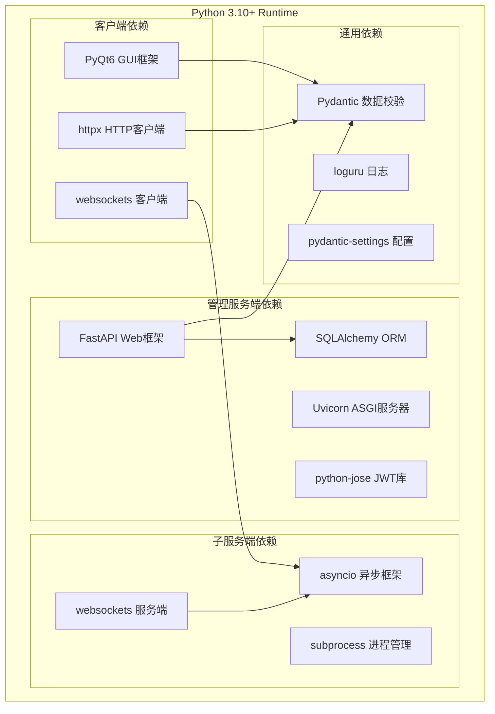
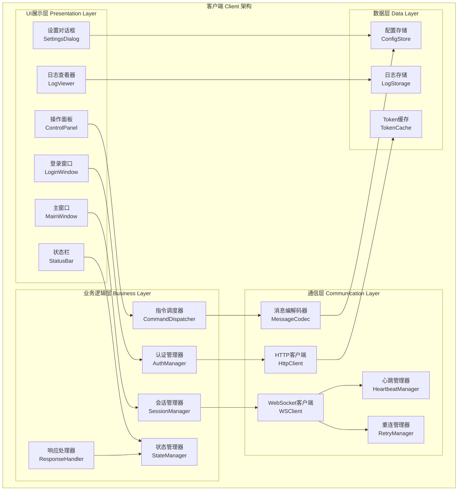
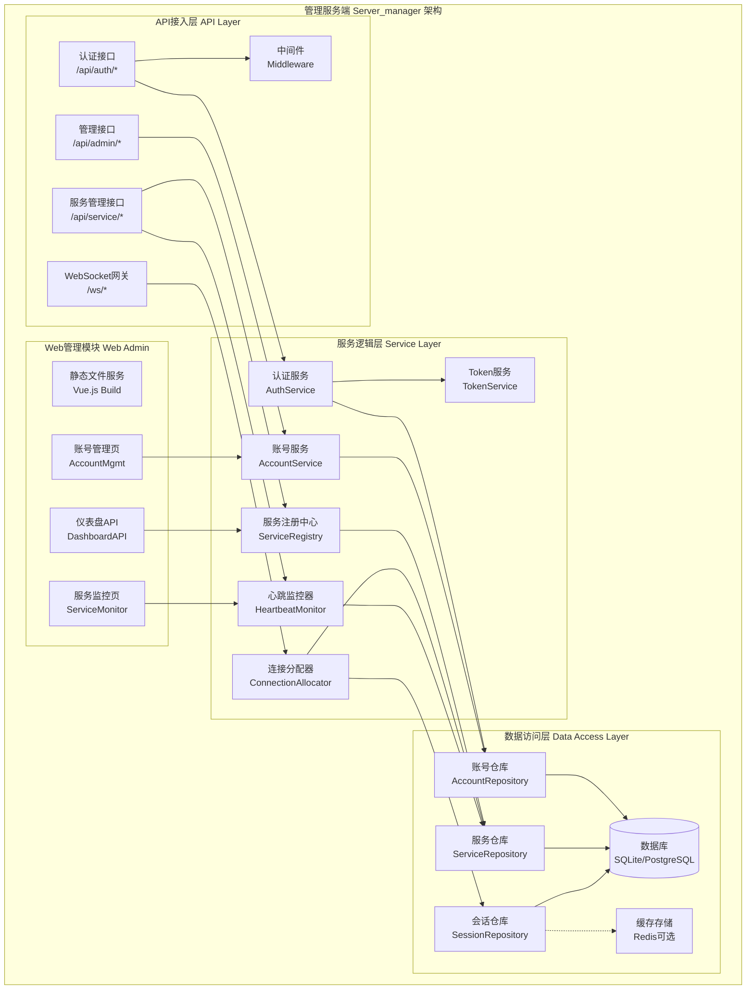
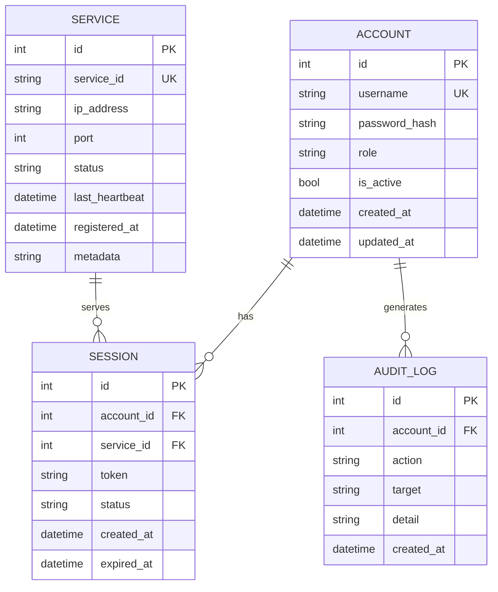
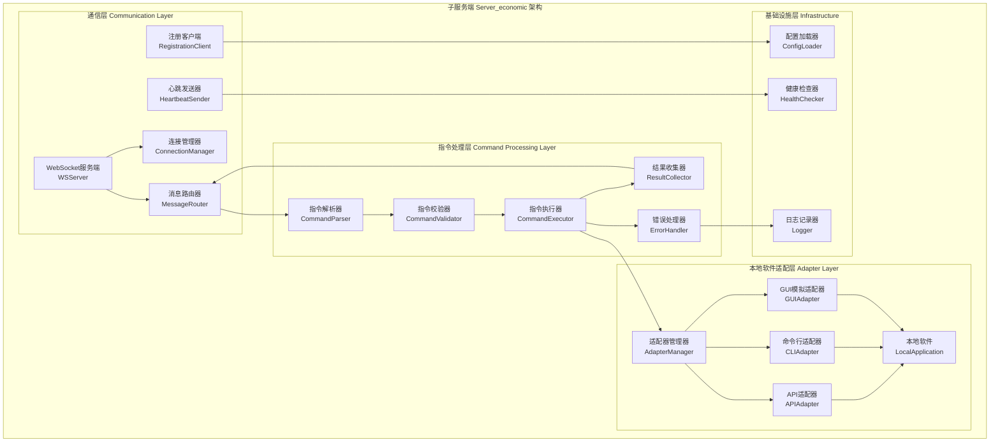
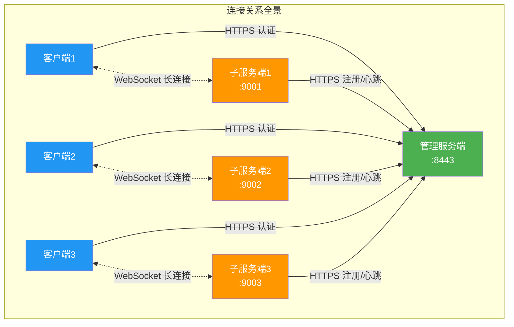
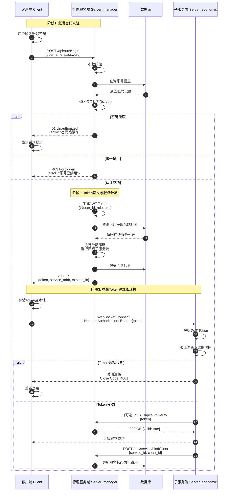
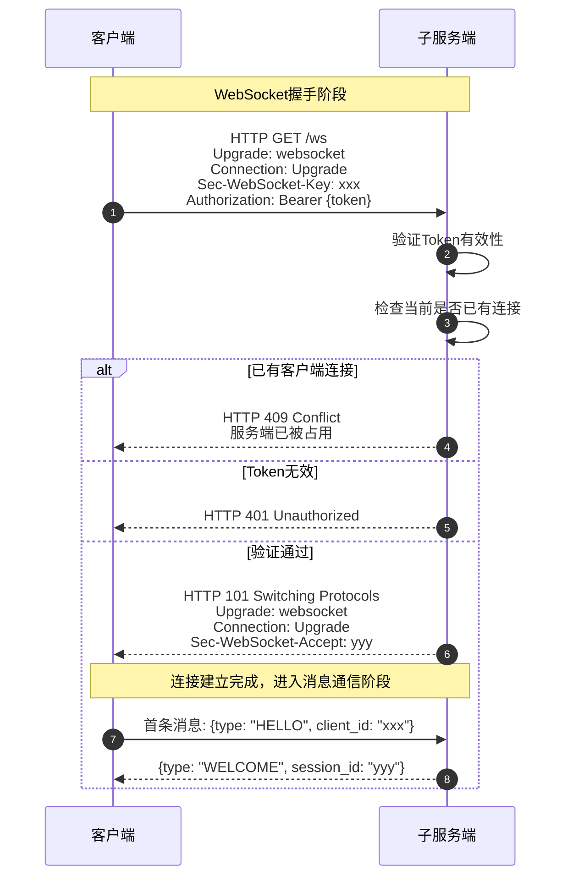
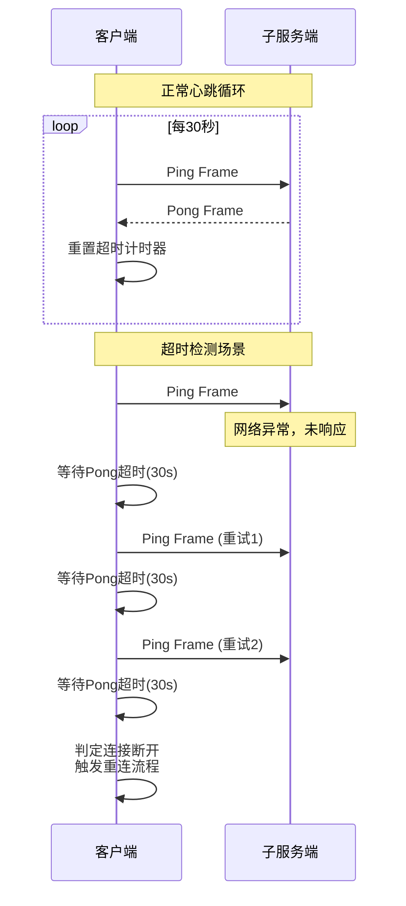
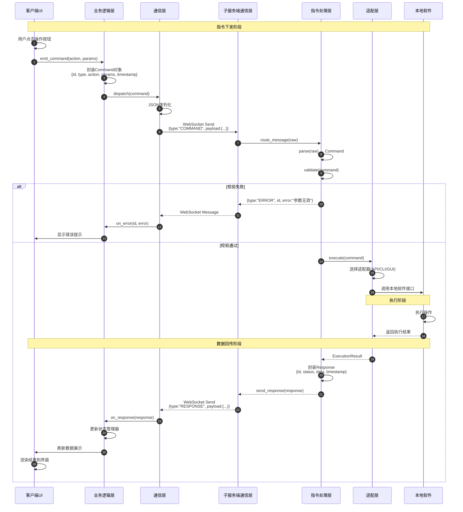

# 三端桌面应用详细架构设计文档（Python技术栈）

> **文档版本**：V1.0 | **创建日期**：2026-04-29 | **技术栈**：Python | **状态**：架构设计完成

---

## 目录

- [1. 技术栈选型说明](#1-技术栈选型说明)
- [2. 客户端（Client）详细架构](#2-客户端client详细架构)
- [3. 管理服务端（Server_manager）详细架构](#3-管理服务端server_manager详细架构)
- [4. 子服务端（Server_economic）详细架构](#4-子服务端server_economic详细架构)
- [5. 三端连接方式详细说明](#5-三端连接方式详细说明)
- [6. 认证流程详细说明](#6-认证流程详细说明)
- [7. 长连接建立机制详细说明](#7-长连接建立机制详细说明)
- [8. 命令传输路径图](#8-命令传输路径图)

---

## 1. 技术栈选型说明

### 1.1 Python技术栈全景

本项目采用Python作为三端统一开发语言，充分利用Python生态的丰富组件库实现快速开发与原型验证。以下是各端的具体技术选型方案。

**选型原则**：开发效率、跨平台能力、社区活跃度、长连接支持能力

### 1.2 技术选型清单

| 端 | 模块 | 技术选型 | 版本要求 | 选型理由 |
| --- | --- | --- | --- | --- |
| 客户端 | GUI框架 | PyQt6/PySide6 | 6.4+ | 跨平台、组件丰富、信号槽机制 |
| 客户端 | HTTP通信 | httpx | 0.24+ | 异步支持、现代API设计 |
| 客户端 | WebSocket | websockets | 11.0+ | 纯Python实现、asyncio原生 |
| 管理服务端 | Web框架 | FastAPI | 0.100+ | 高性能、自动文档、异步原生 |
| 管理服务端 | ORM | SQLAlchemy | 2.0+ | 成熟稳定、异步支持 |
| 管理服务端 | 数据库 | SQLite/PostgreSQL | - | 开发用SQLite，生产用PostgreSQL |
| 管理服务端 | WebSocket | fastapi-websocket | - | FastAPI内置支持 |
| 子服务端 | 异步框架 | asyncio | 3.10+ | Python标准库 |
| 子服务端 | WebSocket | websockets | 11.0+ | 轻量级、高性能 |
| 通用 | 消息序列化 | JSON/Pydantic | 2.0+ | 类型安全、自动校验 |
| 通用 | 日志 | loguru | 0.7+ | 简洁API、自动轮转 |
| 通用 | 配置管理 | pydantic-settings | 2.0+ | 环境变量集成、类型校验 |

### 1.3 依赖关系图



---

## 2. 客户端（Client）详细架构

### 2.1 架构概述

客户端采用经典的四层架构设计：

| 层级 | 说明 |
| --- | --- |
| UI展示层 | 用户交互界面渲染与事件响应 |
| 业务逻辑层 | 核心业务流程封装与状态管理 |
| 通信层 | 统一处理网络交互 |
| 数据层 | 本地持久化存储管理 |

**设计特点**：UI层通过Qt信号槽机制与业务层解耦

### 2.2 分层架构图



### 2.3 模块职责说明

#### UI展示层

采用PyQt6实现跨平台GUI，各组件职责：

| 组件 | 职责 | 关键方法 |
| --- | --- | --- |
| LoginWindow | 登录表单展示与输入校验 | on_login_clicked() |
| MainWindow | 主界面容器、面板管理 | switch_panel() |
| ControlPanel | 功能按钮、操作触发 | emit_command() |
| StatusBar | 实时显示连接状态与系统信息 | - |
| LogViewer | 操作日志滚动查看 | - |
| SettingsDialog | 服务器地址等配置项 | - |

#### 业务逻辑层

封装客户端核心业务流程：

| 组件 | 职责 | 关键方法 |
| --- | --- | --- |
| AuthManager | 登录认证、Token获取与存储 | login(), logout() |
| SessionManager | 会话生命周期管理 | - |
| CommandDispatcher | UI操作转指令、发送调度 | dispatch(cmd) |
| ResponseHandler | 解析回传数据、分发处理 | - |
| StateManager | 全局状态维护、通知UI更新 | - |

#### 通信层

统一管理网络交互：

| 组件 | 职责 | 说明 |
| --- | --- | --- |
| HttpClient | HTTPS短连接通信 | 基于httpx实现 |
| WebSocketClient | 长连接通道 | 基于websockets库 |
| MessageCodec | JSON序列化/反序列化 | - |
| RetryManager | 指数退避断线重连 | - |
| HeartbeatManager | 定时心跳维持连接 | - |

#### 数据层

本地持久化存储：

| 组件 | 职责 | 说明 |
| --- | --- | --- |
| ConfigStore | 配置读写 | JSON格式存储 |
| TokenCache | Token安全存储 | 支持过期检测 |
| LogStorage | 操作日志记录 | 按日期轮转 |

---

## 3. 管理服务端（Server_manager）详细架构

### 3.1 架构概述

管理服务端采用经典三层架构，结合FastAPI框架特性划分为：

| 层级 | 说明 |
| --- | --- |
| API接入层 | 请求路由、参数校验、响应封装 |
| 服务逻辑层 | 核心业务逻辑 |
| 数据访问层 | 数据持久化操作 |
| Web管理模块 | 运维管理界面 |

**设计特点**：各层通过依赖注入方式解耦，便于单元测试与模块替换

### 3.2 分层架构图



### 3.3 模块职责说明

#### API接入层

系统统一入口：

| 组件 | 路径 | 职责 |
| --- | --- | --- |
| AuthAPI | /api/auth/* | 客户端登录认证 |
| ServiceAPI | /api/service/* | 子服务端注册与心跳 |
| AdminAPI | /api/admin/* | Web管理端操作 |
| WebSocketGateway | /ws/* | 长连接网关（可选） |
| Middleware | - | 日志、异常、JWT验证 |

#### 服务逻辑层

核心业务逻辑：

| 组件 | 职责 | 说明 |
| --- | --- | --- |
| AuthService | 账号密码验证、登录状态 | - |
| AccountService | 账号CRUD操作 | - |
| ServiceRegistry | 子服务端注册表管理 | 上线与下线 |
| ConnectionAllocator | 为客户端分配子服务端 | 分配策略 |
| HeartbeatMonitor | 心跳监控、超时检测 | - |
| TokenService | JWT生成、验证、刷新 | - |

#### 数据访问层

数据持久化操作，基于SQLAlchemy 2.0实现ORM：

| 组件 | 职责 | 说明 |
| --- | --- | --- |
| AccountRepo | 账号数据存取 | - |
| ServiceRepo | 服务数据存取 | - |
| SessionRepo | 会话数据存取 | - |
| Database | SQLite/PostgreSQL | 开发/生产双模式 |
| CacheStore | Redis缓存 | 可选组件 |

#### Web管理模块

基于浏览器的运维界面：

| 组件 | 职责 |
| --- | --- |
| StaticFiles | Vue.js构建产物服务 |
| DashboardAPI | 仪表盘数据接口 |
| AccountMgmtPage | 账号增删改查 |
| ServiceMonitorPage | 子服务端状态监控 |

### 3.4 数据库表结构设计



---

## 4. 子服务端（Server_economic）详细架构

### 4.1 架构概述

子服务端采用轻量化设计，分为三个核心层级：

| 层级 | 说明 |
| --- | --- |
| 通信层 | 与管理服务端及客户端的网络交互 |
| 指令处理层 | 命令解析与执行调度 |
| 本地软件适配层 | 对本地软件的具体操控 |

### 4.2 分层架构图



### 4.3 模块职责说明

#### 通信层

管理所有网络交互：

| 组件 | 职责 | 关键方法 |
| --- | --- | --- |
| RegistrationClient | 启动时注册请求 | register_to_manager() |
| HeartbeatSender | 定时心跳维持 | send_heartbeat() |
| WebSocketServer | 客户端长连接监听 | start_server() |
| MessageRouter | 消息类型分发 | - |
| ConnectionManager | 连接生命周期管理 | - |

#### 指令处理层

命令完整处理流程：

| 组件 | 职责 |
| --- | --- |
| CommandParser | JSON解析为Command对象 |
| CommandValidator | 权限检查、参数校验 |
| CommandExecutor | 执行调度中心 |
| ResultCollector | 结果封装为标准响应 |
| ErrorHandler | 异常处理、日志记录 |

#### 本地软件适配层

采用策略模式设计，支持自定义扩展：

| 组件 | 操控方式 |
| --- | --- |
| APIAdapter | HTTP/SDK调用本地API |
| CLIAdapter | subprocess执行命令行 |
| GUIAdapter | pyautogui模拟键鼠（无API软件） |

---

## 5. 三端连接方式详细说明

### 5.1 通信协议选择

系统采用 **HTTPS + WebSocket** 双协议架构：

| 场景 | 协议 | 说明 |
| --- | --- | --- |
| 认证、注册、管理操作 | HTTPS | 短连接、安全性高 |
| 指令交互、实时数据 | WebSocket | 长连接、低延迟双向通信 |

### 5.2 通信路径

| 通信路径 | 协议 | 端口 | 数据格式 | 加密方式 |
| --- | --- | --- | --- | --- |
| 客户端→管理服务端 | HTTPS | 443/8443 | JSON | TLS 1.3 |
| 子服务端→管理服务端 | HTTPS | 443/8443 | JSON | TLS 1.3 |
| Web管理端→管理服务端 | HTTPS | 443/8443 | JSON | TLS 1.3 |
| 客户端↔子服务端 | WebSocket | 9000+ | JSON | WSS(TLS) |

### 5.3 连接关系图



---

## 6. 认证流程详细说明

### 6.1 JWT认证方案

认证流程采用JWT（JSON Web Token）方案：

1. 客户端提交账号密码
2. 管理服务端验证通过后签发Token
3. 后续请求携带Token进行身份校验
4. Token中嵌入用户ID、角色、过期时间等声明
5. 子服务端可通过公钥本地验证Token有效性

### 6.2 Token结构设计

| 字段 | 类型 | 说明 | 示例值 |
| --- | --- | --- | --- |
| sub | string | 用户ID | "user_001" |
| username | string | 用户名 | "admin" |
| role | string | 角色 | "operator" |
| iat | int | 签发时间戳 | 1714380000 |
| exp | int | 过期时间戳 | 1714466400 |
| jti | string | Token唯一ID | "uuid-xxxx" |
| allocated_service | string | 分配的子服务端ID | "service_001" |

**签名算法**：RS256，确保Token不可篡改

### 6.3 完整认证时序



---

## 7. 长连接建立机制详细说明

### 7.1 WebSocket握手流程

客户端与子服务端之间的长连接基于WebSocket协议建立：

1. 握手通过HTTP Upgrade机制完成协议切换
2. 握手成功后建立全双工通信通道
3. 生产环境建议使用WSS确保传输加密



### 7.2 心跳保活机制

| 参数 | 值 | 说明 |
| --- | --- | --- |
| 心跳间隔 | 30秒 | 定期交换心跳消息 |
| 超时阈值 | 3次周期(90秒) | 检测网络异常 |

**实现方式**：WebSocket内置Ping/Pong帧



### 7.3 断线重连策略

采用指数退避重连策略：

| 参数 | 值 |
| --- | --- |
| 初始间隔 | 1秒 |
| 最大间隔 | 60秒 |
| 最大重试 | 10次 |

**重试间隔计算**：`delay = min(2^n, 60)` 秒

| 重试次数 | 等待时间(秒) | 累计耗时(秒) |
| --- | --- | --- |
| 1 | 1 | 1 |
| 2 | 2 | 3 |
| 3 | 4 | 7 |
| 4 | 8 | 15 |
| 5 | 16 | 31 |
| 6 | 32 | 63 |
| 7 | 60 | 123 |
| 8 | 60 | 183 |
| 9 | 60 | 243 |
| 10 | 60 | 303 |

```mermaid
flowchart TD
    A[检测到连接断开] --> B{重试次数 < 10?}
    B -->|是| C[计算等待时间<br/>delay = min(2^n, 60)秒]
    C --> D[等待delay秒]
    D --> E[尝试重新连接]
    E --> F{连接成功?}
    F -->|是| G[重置重试计数器<br/>恢复正常通信]
    F -->|否| H[重试次数+1]
    H --> B
    B -->|否| I{Token是否过期?}
    I -->|是| J[清除本地Token<br/>跳转登录界面]
    I -->|否| K[提示网络异常<br/>用户手动重试]
```

---

## 8. 命令传输路径图

### 8.1 消息格式规范

所有通信消息采用统一JSON结构，包含：类型标识、唯一ID、时间戳、业务载荷

**指令消息格式**（客户端→子服务端）：

```json
{
    "type": "COMMAND",
    "id": "cmd_20260429_001",
    "timestamp": 1714380000000,
    "payload": {
        "action": "START_PROCESS",
        "params": {
            "process_name": "target_app.exe",
            "arguments": ["--config", "default"]
        }
    }
}
```

**响应消息格式**（子服务端→客户端）：

```json
{
    "type": "RESPONSE",
    "id": "cmd_20260429_001",
    "timestamp": 1714380001000,
    "payload": {
        "status": "SUCCESS",
        "code": 0,
        "data": {
            "pid": 12345,
            "message": "进程启动成功"
        }
    }
}
```

### 8.2 消息类型

| 消息类型 | 方向 | 用途 |
| --- | --- | --- |
| COMMAND | 客户端→子服务端 | 下发操作指令 |
| RESPONSE | 子服务端→客户端 | 返回执行结果 |
| EVENT | 子服务端→客户端 | 主动推送状态变更 |
| PING/PONG | 双向 | 心跳保活 |
| ERROR | 子服务端→客户端 | 错误通知 |

### 8.3 指令下发与数据回传完整链路

命令传输采用请求-响应模式，每条指令携带唯一ID用于关联响应。



---

## 附录：预留功能清单

### 客户端预留

| 模块 | 预留功能 | 优先级 | 扩展说明 |
| --- | --- | --- | --- |
| UI层 | 更多功能面板 | P2 | 根据业务需求扩展操作界面 |
| 业务层 | 业务插件接口 | P3 | 支持动态加载业务处理插件 |
| 数据层 | 本地数据缓存 | P2 | 缓存历史指令与结果，支持离线查看 |

### 管理服务端预留

| 模块 | 预留功能 | 优先级 | 扩展说明 |
| --- | --- | --- | --- |
| API层 | 更多API端点 | P2 | 扩展报表统计、批量操作等接口 |
| 服务层 | 审计日志服务 | P1 | 记录所有操作日志，支持合规审计 |
| Web模块 | 操作审计页 | P2 | 可视化展示操作记录与统计 |

### 子服务端预留

| 模块 | 预留功能 | 优先级 | 扩展说明 |
| --- | --- | --- | --- |
| 指令层 | 指令队列管理 | P2 | 支持指令排队、优先级调度 |
| 适配层 | 自定义适配器接口 | P1 | 插件化支持更多本地软件类型 |

### 通用预留

| 模块 | 预留功能 | 优先级 | 扩展说明 |
| --- | --- | --- | --- |
| 安全 | 多因素认证(MFA) | P2 | 支持TOTP二次验证 |
| 监控 | 分布式追踪 | P3 | 集成OpenTelemetry追踪链路 |

---

*文档版本：V1.0 | 创建日期：2026-04-29 | 技术栈：Python | 状态：架构设计完成*
