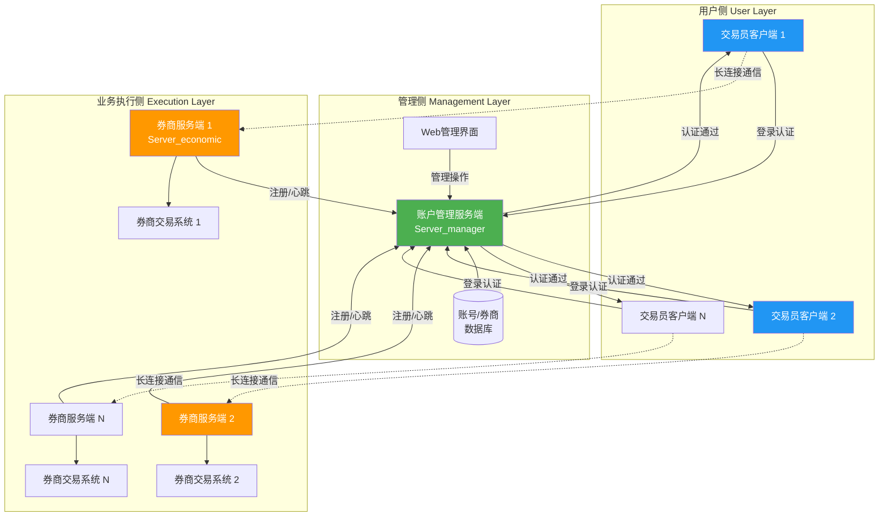
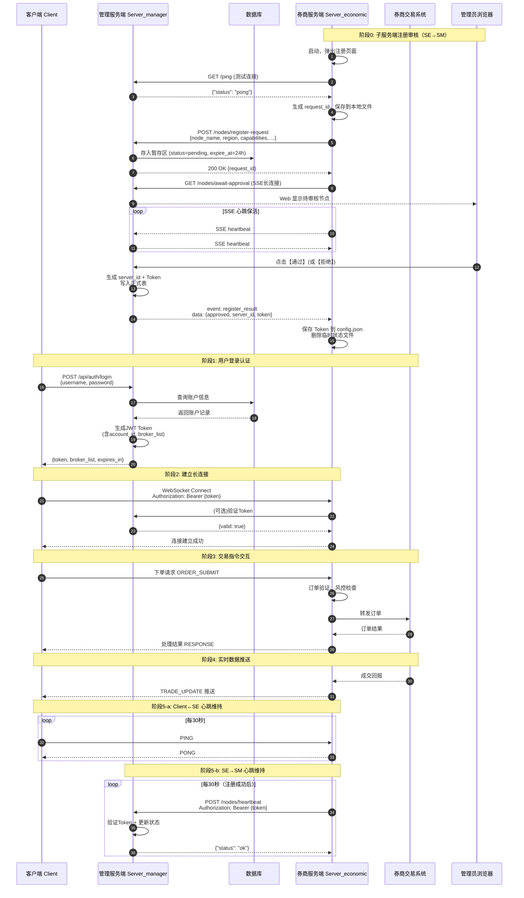
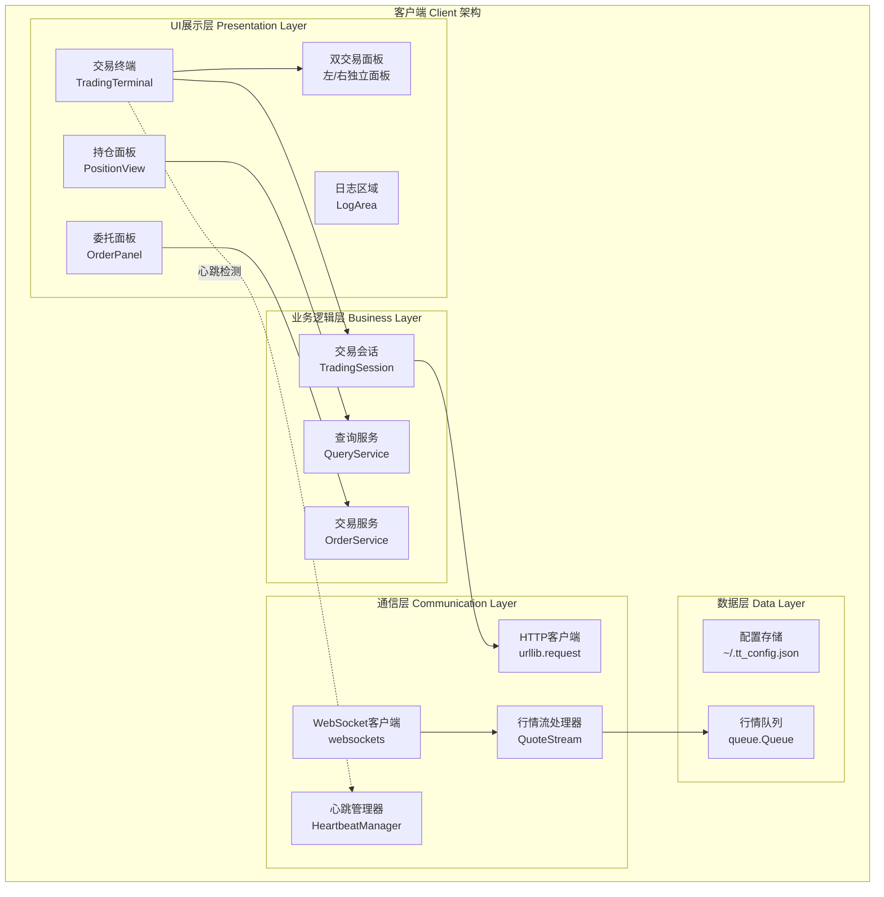
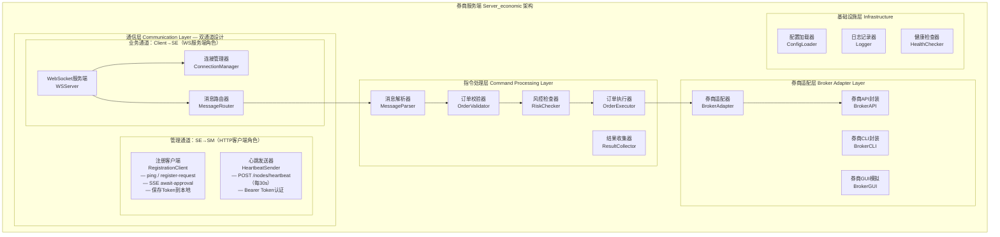
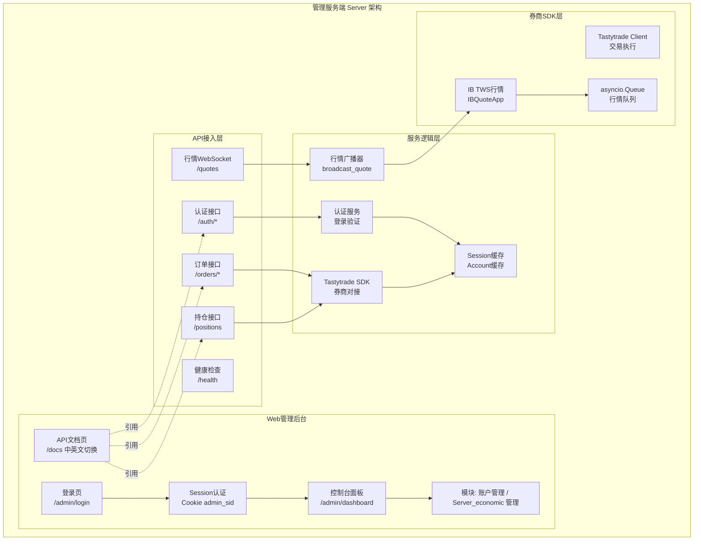
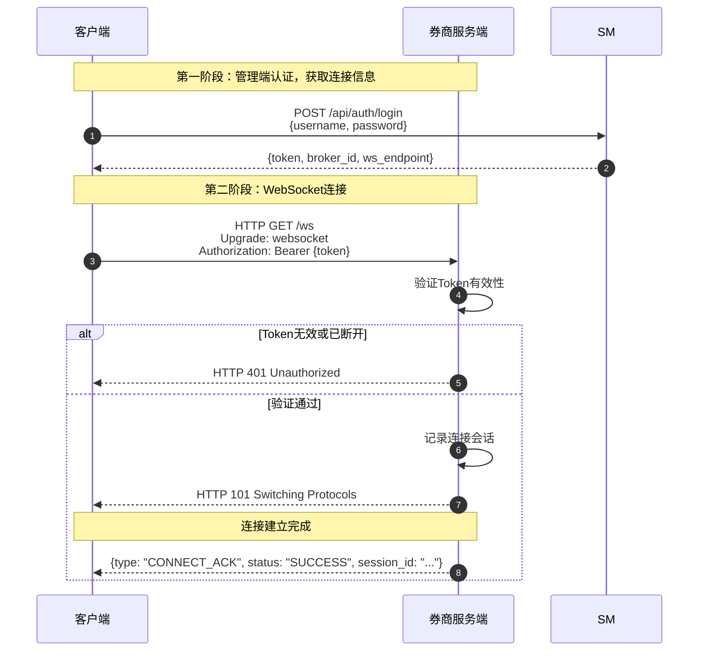

# 证券股票交易系统产品文档

> **文档版本**：V1.0 | **编制日期**：2026-04-28 | **技术栈**：Python + Tkinter/asyncio/FastAPI + tastytrade SDK + IB TWS | **密级**：内部资料

---

## 目录

- [1. 产品概述](#1-产品概述)
- [2. 系统架构](#2-系统架构)
- [3. 功能模块设计](#3-功能模块设计)
- [4. 技术方案](#4-技术方案)
- [5. 安全设计](#5-安全设计)
- [6. 运维监控](#6-运维监控)
- [7. 预留功能清单](#7-预留功能清单)

---

## 1. 产品概述

### 1.1 产品背景

随着证券交易市场的快速发展，交易员对交易系统的稳定性、实时性和便捷性提出了更高要求。传统基于HTTP轮询的交易系统存在延迟高、资源消耗大、实时性差等问题，无法满足专业交易员的需求。

本系统采用 **WebSocket长连接技术**，构建一套高效、稳定、实时的证券股票交易平台，实现交易员与券商交易系统的实时双向通信。

**核心价值**：
- 实现毫秒级订单响应，提升交易效率
- 长连接保活机制，确保连接稳定
- 多重安全验证，保障交易安全

### 1.2 产品目标

| 目标 | 说明 |
| --- | --- |
| 高效性 | 实现毫秒级订单响应，提升交易效率 |
| 稳定性 | 长连接保活机制，确保连接稳定 |
| 安全性 | 多重安全验证，保障交易安全 |
| 可扩展性 | 模块化设计，支持功能扩展 |
| 可维护性 | 完善的监控运维体系 |

### 1.3 目标用户

| 用户类型 | 角色描述 | 主要功能 |
| --- | --- | --- |
| 交易员 | 执行交易操作 | 行情查看、下单、撤单、持仓查询 |
| 公司管理员 | 管理交易员账户 | 账户管理、权限分配、券商管理 |
| 系统运维 | 系统维护监控 | 状态监控、故障处理、日志分析 |

### 1.4 系统定位

本系统定位为 **企业级分布式证券交易操控平台**，适用于需要通过统一客户端操控分散部署的多券商交易系统的场景。

**系统强调**：
- **安全性**：认证授权、消息签名、防重放攻击
- **可靠性**：长连接与心跳机制、断线自动重连
- **实时性**：WebSocket全双工通信、毫秒级响应
- **可管理性**：Web集中管控、运维监控

---

## 2. 系统架构

### 2.1 整体架构

本系统采用 **三层分布式架构** 设计，用户侧、管理侧、业务执行侧通过明确的通信协议进行交互：

| 层级 | 组件 | 核心职责 | 部署位置 |
| --- | --- | --- | --- |
| 用户侧 | 客户端 Client | 交易员登录、界面操作、指令下发、数据展示 | 交易员本地PC |
| 管理侧 | Server_manager + Web | 账号管理、券商注册、连接分配、系统监控 | 中心服务器 |
| 业务执行侧 | Server_economic | 命令接收、券商对接、交易执行、数据回传 | 券商服务器/业务机器 |

### 2.2 系统架构图



### 2.3 数据流向



### 2.4 技术选型

| 端 | 模块 | 技术选型 | 版本要求 | 说明 |
| --- | --- | --- | --- | --- |
| 客户端 | GUI框架 | Tkinter | 3.7+ | Python标准库，无需额外安装，轻量化设计 |
| 客户端 | HTTP通信 | urllib | - | Python标准库，同步请求 |
| 客户端 | WebSocket | websockets | 11.0+ | 异步行情流接收 |
| 客户端 | 异步支持 | asyncio + threading | 3.7+ | 网络请求在线程中执行 |
| 管理服务端 | Web框架 | FastAPI + Uvicorn | 0.110+ | 高性能、自动文档、异步原生 |
| 管理服务端 | 模板引擎 | Jinja2 | 3.1.x (3.1.2~<3.1.5) | Web管理后台页面渲染（注意版本兼容性） |
| 管理服务端 | 表单解析 | python-multipart | 0.0.6+ | 登录表单POST解析必需 |
| 管理服务端 | ORM | 直接操作 | - | 轻量化设计，无需额外ORM |
| 管理服务端 | 数据库 | SQLite | - | 嵌入式，适合中小规模 |
| 券商服务端 | 券商SDK | tastytrade | - | 对接Tastytrade券商账户，支持美股交易 |
| 券商服务端 | 行情API | IB TWS API | - | Interactive Brokers行情源，提供实时行情 |
| 券商服务端 | 异步框架 | asyncio | 3.7+ | Python标准库 |
| 通用 | SSL处理 | certifi | - | 证书管理，解决Windows证书链问题 |

### 2.5 通信路径

| 通信路径 | 协议 | 端口 | 数据格式 | 加密方式 |
| --- | --- | --- | --- | --- |
| 客户端→管理服务端 | HTTP | 8800 | JSON | 开发环境明文，生产环境HTTPS |
| 客户端↔管理服务端 | WebSocket | 8800 | JSON | ws://开发环境，wss://生产环境 |
| 管理员浏览器→管理服务端 | HTTP | 8800 | HTML/JSON/Form | 开发环境明文，生产环境HTTPS |
| **子服务端→管理服务端（注册/心跳）** | **HTTP + SSE** | **8800** | **JSON / SSE EventStream** | **开发环境明文，生产环境HTTPS** |
| 管理服务端→IB TWS | TCP | 7496/7497 | 二进制协议 | IB API加密 |
| 管理服务端→Tastytrade | HTTPS | 443 | JSON | TLS加密 |

> **注**：子服务端（Server_economic）向管理服务端的通信包含两条链路——注册审核阶段使用 **HTTP REST + SSE**（测试连接/提交注册/SSE等待审核通知），运行阶段使用 **HTTP POST 心跳保活**。详见 [§4.6 节点注册与连接协议](#46-节点注册与连接协议)。

---

## 3. 功能模块设计

### 3.1 客户端功能模块

#### 3.1.1 登录模块

| 功能 | 描述 |
| --- | --- |
| 用户登录 | 输入用户名密码进行认证 |
| Token管理 | 自动管理Token刷新和存储 |
| 连接管理 | 自动建立/重连券商服务端连接 |
| 会话保持 | 支持会话持久化，凭证本地存储 |
| 凭证保存 | 可选的本地凭证存储（JSON配置文件） |

#### 3.1.2 交易模块

| 功能 | 描述 |
| --- | --- |
| 下单操作 | 支持限价单(Limit)、市价单(Market) |
| 撤单操作 | 支持委托单撤销，支持右键撤单、Esc批量撤单 |
| 改单操作 | 支持修改委托价格和数量 |
| 批量下单 | 支持批量委托 |

**订单类型说明**：

| 订单类型 | 说明 |
| --- | --- |
| Limit | 限价单，指定价格成交 |
| Market | 市价单，以市场最优价成交 |

**TIF（Time In Force）选项**：

| TIF | 说明 |
| --- | --- |
| Day | 当日有效 |
| GTC | Good Till Cancelled，取消前有效 |
| IOC | Immediate Or Cancel，立即成交否则取消 |
| EXT | 盘前盘后交易 |
| GTC_EXT | 取消前有效（含盘前盘后） |

**智能下单逻辑**：

系统根据当前持仓自动选择正确的订单动作：

| 用户操作 | 持仓状态 | 执行动作 |
| --- | --- | --- |
| 买入 | 无持仓或多头 | Buy to Open（开多） |
| 买入 | 空头 | Buy to Close（平空） |
| 卖出 | 无持仓或空头 | Sell to Open（开空） |
| 卖出 | 多头 | Sell to Close（平多） |

#### 3.1.3 查询模块

| 功能 | 描述 |
| --- | --- |
| 持仓查询 | 查询当前持仓情况，含多头/空头分离显示 |
| 委托查询 | 查询当日/历史委托，支持Live/All切换 |
| 成交查询 | 查询当日/历史成交 |
| 资金查询 | 查询账户资金状况（今日已实现盈亏等） |
| 行情查询 | 查询股票实时行情（LAST/BID/ASK/涨跌/成交量） |

**持仓数据结构**：

| 字段 | 说明 |
| --- | --- |
| Symbol | 股票代码 |
| Bot | 实际买入股数（开多+平空） |
| Sld | 实际卖出股数（平多+开空） |
| Pos | 净持仓（正=多头，负=空头） |
| AvgPrc | 平均成本价 |
| Last | 最新价 |
| Unrealized | 未实现盈亏 |
| Realized | 今日已实现盈亏 |
| Exes | 成交笔数 |

**订单状态映射**：

| 原始状态 | 显示状态 | 说明 |
| --- | --- | --- |
| Live, Received, Routing | Live | 活动订单 |
| Filled | Filled | 已成交 |
| Cancelled | Cancelled | 已取消 |
| Rejected | Rejected | 已拒绝 |
| Partial | Partial | 部分成交 |
| Cancelling | Cancelling | 取消中 |
| Expired | Expired | 已过期 |

#### 3.1.4 行情模块

| 功能 | 描述 |
| --- | --- |
| 双面板显示 | 左右独立面板，可同时监控两个股票 |
| 实时报价 | 显示最新价(Bid/Ask/Last)、涨跌、成交量 |
| 行情刷新 | 支持模拟行情和真实WebSocket行情流 |
| 面板激活 | 点击或焦点切换激活面板，高亮边框指示 |
| 价格自动填充 | 输入股票代码后自动填充最新卖价到价格框 |

**行情订阅机制**：

| 动作 | 说明 |
| --- | --- |
| subscribe | 订阅标的行情 |
| unsubscribe | 取消订阅标的行情 |

#### 3.1.5 快捷键系统

| 快捷键 | 功能 | 说明 |
| --- | --- | --- |
| F1 | 市价卖出 | 快速市价卖出，自动判断平多/开空 |
| F2 | 限价卖出就绪 | 准备限价卖出，焦点移至价格框 |
| F3 | 市价买入 | 快速市价买入，自动判断平空/开多 |
| F4 | 限价买入就绪 | 准备限价买入，焦点移至价格框 |
| Esc | 取消/撤单 | 取消待下单状态或撤当前股票所有订单 |
| 小键盘1-9 | 设置股数 | 快速设置1000-9000股 |
| Ctrl+1-9 | 设置股数 | 快速设置100-900股 |
| ↑/↓ (Qty) | 调整数量 | ±500股 |
| ←/→ (Qty) | 调整数量 | ±100股 |
| ↑/↓ (Price) | 调整价格 | ±0.05 |
| ←/→ (Price) | 调整价格 | ±0.01 |

#### 3.1.6 模拟交易模式

| 功能 | 描述 |
| --- | --- |
| 模拟行情 | 随机生成模拟股票价格走势 |
| 模拟下单 | 订单在本地模拟执行，不发送到真实交易所 |
| 模拟持仓 | 预定义的模拟持仓数据 |
| 独立运行 | 无需连接服务器即可运行和测试所有UI功能 |

### 3.2 账户管理服务端功能模块

#### 3.2.0 Web 管理后台

Server_manager 内置基于 **Jinja2 模板引擎** 的 Web 管理后台，提供浏览器端可视化管理能力。

| 功能 | 描述 |
| --- | --- |
| 超级管理员登录 | 基于 admin.json 配置文件的账号认证 |
| 会话管理 | Cookie-based Session（admin_sid），有效期7天 |
| 认证守卫 | 未登录访问自动重定向至登录页 |
| 管理仪表盘 | 侧边栏导航 + 模块化内容区 + 底部服务状态栏 |

**Web 后台路由**：

| 方法 | 路由 | 说明 | 认证 |
| --- | --- | --- | --- |
| GET | `/` | 根路径重定向到 `/admin/login` | 否 |
| GET | `/admin/login` | 管理员登录页面 | 否（已登录则跳转 Dashboard） |
| POST | `/admin/login` | 登录表单提交 | 否 |
| GET | `/admin/logout` | 管理员登出 | 是（清除 Cookie 和会话） |
| GET | `/admin/dashboard` | 管理控制台主页 | 是（未登录重定向） |
| GET | `/docs` | API 文档页面（支持中英文切换） | 否 |

**管理员配置文件** (`Server_manager/admin.json`)：

```json
[
  {
    "username": "admin",
    "password": "admin123",
    "role": "super_admin",
    "created_at": "2026-05-07"
  }
]
```

> 注：当前版本管理员账号通过 JSON 文件配置，后续将迁移至数据库存储，支持多角色权限管理。

**管理面板布局**：

```
┌──────────────────────────────────────────────────────┐
│  [Server Manager]          admin  [登出]            │ ← 顶栏
├──────────┬───────────────────────────────────────────┤
│          │                                           │
│  导航侧栏 │           主内容区域                      │
│          │                                           │
│ ● 账户   │  ┌─────────┐  ┌─────────────────────┐    │
│   管理   │  │ 账户管理 │  │ Server_economic 管理 │    │
│          │  │ (占位)   │  │     (占位)           │    │
│ ● Server_│  └─────────┘  └─────────────────────┘    │
│   economic│                                           │
│   管理   │                                           │
│          │                                           │
│ ○ API文档│                                           │
│          │                                           │
├──────────┴───────────────────────────────────────────┤
│ DEMO模式 | SDK:可用 | IB:未连接 | 客户端:0         │ ← 状态栏
└──────────────────────────────────────────────────────┘
```

**底部状态栏信息**：

| 字段 | 说明 |
| --- | --- |
| 运行模式 | LIVE（Tastytrade 已连接）/ DEMO（模拟数据） |
| SDK 状态 | 可用 / 不可用 |
| IB TWS | 已连接 / 未连接 |
| 活跃客户端数 | 当前连接的 WebSocket 行情订阅客户端数量 |

#### 3.2.1 账户管理

| 功能 | 描述 |
| --- | --- |
| 账户创建 | 创建新的交易员账户 |
| 账户修改 | 修改账户信息 |
| 账户冻结 | 冻结/解冻账户 |
| 账户删除 | 删除账户 |

#### 3.2.2 权限管理

| 功能 | 描述 |
| --- | --- |
| 角色管理 | 定义不同角色权限 |
| 权限分配 | 为用户分配权限 |
| 券商绑定 | 绑定用户可访问的券商 |

#### 3.2.3 券商管理

| 功能 | 描述 |
| --- | --- |
| 券商注册 | 注册券商服务端信息（含管理员人工审核）|
| 券商配置 | 配置券商连接参数 |
| 券商监控 | 监控券商服务端状态与心跳 |
| 券商移除 | 移除券商连接 |

**注册审核工作流**：

子服务端（Server_economic）首次启动时需向管理服务端（Server_manager）完成注册审核，全过程采用 **HTTP REST 提交 + SSE 被动等待** 模式：

```
子服务端                        管理端                    管理员
───────                        ──────                    ────

1. 测试连接: GET /ping ──────→ 返回 pong
2. 提交注册: POST /nodes/register-request → 存入暂存区(24h有效)
3. SSE等待: GET /nodes/await-approval → 加入SSE等待队列
4.                     Web显示待审核 ──→ 管理员操作
5.                     ◄── 管理员点击【通过】
6. ←── SSE推送 register_result (含server_id + token)
7. 保存Token，进入正常运行
8. POST /nodes/heartbeat (每30s) ──→ 保活
```

> 详细协议定义见 [§4.6 节点注册与连接协议](#46-节点注册与连接协议)。

### 3.3 券商服务端功能模块

#### 3.3.1 连接管理

| 功能 | 描述 |
| --- | --- |
| 连接建立 | 接受WebSocket连接 |
| 认证鉴权 | 验证Token有效性 |
| 会话管理 | 管理在线会话 |
| 心跳检测 | 维护连接活跃 |

#### 3.3.2 交易处理

| 功能 | 描述 |
| --- | --- |
| 订单验证 | 验证订单参数合法性 |
| 风险检查 | 执行交易风控规则 |
| 订单路由 | 转发订单到券商系统 |
| 结果处理 | 处理券商返回结果 |
| tastytrade SDK | 使用官方SDK对接Tastytrade账户执行真实交易 |

**支持的订单动作**：

| 动作 | 说明 |
| --- | --- |
| Buy to Open | 买入开仓（做多） |
| Sell to Close | 卖出平仓（平多） |
| Sell to Open | 卖出开仓（做空） |
| Buy to Close | 买入平仓（平空） |

#### 3.3.3 实时推送

| 功能 | 描述 |
| --- | --- |
| 订单状态推送 | 推送委托状态变化 |
| 成交回报推送 | 推送成交信息 |
| 持仓同步推送 | 推送持仓变动 |
| 告警推送 | 推送风险告警 |

#### 3.3.4 行情服务（IB TWS集成）

| 功能 | 描述 |
| --- | --- |
| IB TWS连接 | 通过IB API连接到Interactive Brokers |
| 行情订阅 | 订阅/取消订阅股票行情 |
| 实时推送 | 推送BID/ASK/LAST/VOLUME行情数据 |
| 自动重连 | 断线自动重连，保持行情连接 |

**IB TWS行情封装**：

```
IB TWS API (TCP:7496/7497)
        ↓
IBQuoteApp (EWrapper + EClient)
        ↓
asyncio.Queue
        ↓
quote_stream_loop
        ↓
broadcast_quote (WebSocket推送)
```

#### 3.3.5 时区处理

| 配置 | 值 |
| --- | --- |
| 时区 | 美东时间 (America/New_York) |
| 交易日定义 | 04:00 - 20:00 ET |
| 用途 | 订单时间过滤、盈亏计算 |

---

## 4. 技术方案

### 4.1 客户端详细架构

#### 4.1.1 分层架构

客户端采用经典的四层架构设计：

| 层级 | 说明 |
| --- | --- |
| UI展示层 | 用户交互界面渲染与事件响应 |
| 业务逻辑层 | 核心业务流程封装与状态管理 |
| 通信层 | 统一处理网络交互 |
| 数据层 | 本地持久化存储管理 |

**设计特点**：
- 使用Tkinter构建单窗口内嵌布局，无浮动子窗口
- 网络请求在独立工作线程执行，避免阻塞UI
- 定时轮询机制更新持仓和订单状态

#### 4.1.2 线程模型

| 线程 | 职责 |
| --- | --- |
| 主线程 | UI渲染和事件处理 |
| 工作线程 | 网络请求（HTTP/WebSocket）、数据获取 |
| 定时器 | 每150ms执行一次轮询，更新持仓和检查连接 |

**异步方案**：
- WebSocket连接和消息接收使用asyncio
- HTTP请求使用threading在线程中执行
- 通过queue.Queue实现线程间通信

```python
# HTTP请求在工作线程执行
def _bg():
    ok, msg = self.ts.place_order(...)
    self.after(0, lambda: self._log(msg, "ok" if ok else "err"))

threading.Thread(target=_bg, daemon=True).start()

# WebSocket在独立线程的event loop执行
async def _proxy_stream():
    async with websockets.connect(uri) as ws:
        async for msg in ws:
            self.after(0, lambda m=msg: self._handle_message(m))
```

#### 4.1.3 界面布局

```
┌─────────────────────────────────────────────────────────────────┐
│  ◈ TRADING TERMINAL    Username: ___  Password: ___  [Connect] │
├─────────────────────────────────────────────────────────────────┤
│  ┌──────────────────────┐  ┌──────────────────────┐             │
│  │ Symbol: AAPL        │  │ Symbol: NVDA        │             │
│  │ LAST: 189.42 BID... │  │ LAST: 875.20 BID... │             │
│  ├──────────────────────┤  ├──────────────────────┤             │
│  │ Type: [Limit▼] TIF..│  │ Type: [Limit▼] TIF..│             │
│  │ Qty: 100  Price:... │  │ Qty: 100  Price:... │             │
│  │ [▲ BUY] [▼ SELL]    │  │ [▲ BUY] [▼ SELL]    │             │
│  └──────────────────────┘  └──────────────────────┘             │
├─────────────────────────────────────────────────────────────────┤
│  Orders              │  Positions & P&L                         │
│  [● Live] [All] ⟳   │  Today's Shares: 500  Realized: +$27.00 │
│  ─────────────────   │  Unrealized P&L: -$318.00               │
│  Symbol  Side  Qty.. │  ──────────────────────────────────────  │
│  AAPL     BUY  100.. │  Sym   Pos   AvgPrc   Unreal   Realized │
│                      │  AAPL  +100  185.20   +$422.00  +$155.00│
│                      │  NVDA   -50  890.00   -$740.00  -$120.00│
├─────────────────────────────────────────────────────────────────┤
│  [09:45:23]  Connected to server                               │
│  [09:45:25]  Order submitted — ID: xxx12345                    │
└─────────────────────────────────────────────────────────────────┘
```

#### 4.1.4 分层架构图



#### 4.1.5 模块职责说明

**UI展示层**：

| 组件 | 职责 | 关键方法 |
| --- | --- | --- |
| TradingTerminal | 主窗口容器、Tkinter主循环 | mainloop() |
| DualTradingPanels | 双面板管理、行情显示、下单控件 | _on_symbol_enter() |
| PositionPanel | 持仓表格、盈亏计算 | _refresh_positions() |
| OrderPanel | 委托表格、撤单操作 | _refresh_orders() |
| LogArea | 日志显示、颜色编码 | _log() |

**业务逻辑层**：

| 组件 | 职责 | 关键方法 |
| --- | --- | --- |
| TradingSession | HTTP通信、会话管理 | login(), place_order(), cancel_order() |
| OrderService | 下单/撤单业务逻辑 | place_order(), cancel_order() |
| QueryService | 持仓/委托查询 | get_today_activity(), get_orders() |

**通信层**：

| 组件 | 职责 | 说明 |
| --- | --- | --- |
| HttpClient | HTTP短连接通信 | urllib.request实现 |
| WebSocketClient | 长连接通道 | websockets库 |
| QuoteStream | 行情流订阅/接收 | _proxy_stream() |
| HeartbeatManager | 定时心跳检测连接状态 | _poll() |

#### 4.1.6 颜色主题

| 变量 | 色值 | 用途 |
| --- | --- | --- |
| DARK_BG | #0d0f14 | 主背景色 |
| PANEL_BG | #13161e | 面板背景色 |
| BORDER | #1e2330 | 边框色 |
| ACCENT_BLUE | #4f9eff | 强调蓝色（连接状态） |
| ACCENT_GREEN | #00d68f | 强调绿色（盈利、买入） |
| ACCENT_RED | #ff4d6a | 强调红色（亏损、卖出） |
| TEXT_PRIMARY | #e8ecf4 | 主要文字色 |
| TEXT_DIM | #6b7590 | 次要文字色 |

### 4.2 券商服务端详细架构

#### 4.2.1 分层架构

券商服务端采用轻量化设计，分为三个核心层级：

| 层级 | 说明 |
| --- | --- |
| 通信层 | 与管理服务端及客户端的网络交互 |
| 指令处理层 | 命令解析与执行调度 |
| 券商适配层 | 对券商交易系统的具体操控 |

#### 4.2.2 分层架构图



#### 4.2.3 模块职责说明

**通信层**：

| 组件 | 职责 | 关键方法 |
| --- | --- | --- |
| RegistrationClient | **向管理端发起完整注册流程**（四步：ping→register→SSE等待→保存Token）| `test_connection()`, `submit_registration()`, `await_approval_sse()`, `save_credentials()` |
| HeartbeatSender | 注册成功后，以 Bearer Token 向管理端定时 POST 心跳（每30s）| `start_heartbeat_loop()`, `send_heartbeat()`, `stop()` |
| WebSocketServer | 客户端长连接监听 | start_server() |
| MessageRouter | 消息类型分发 | route_message() |
| ConnectionManager | 连接生命周期管理 | - |

**指令处理层**：

| 组件 | 职责 |
| --- | --- |
| MessageParser | JSON解析为消息对象 |
| OrderValidator | 订单参数校验 |
| RiskChecker | 交易风控规则检查 |
| OrderExecutor | 执行调度中心 |
| ResultCollector | 结果封装为标准响应 |

**券商适配层**：

| 组件 | 操控方式 | 说明 |
| --- | --- | --- |
| BrokerAdapter | 统一调用入口 | 根据券商类型分发到对应适配器 |
| HTTPAdapter | HTTP/REST调用 | 通过HTTP请求调用券商REST API |
| SDKAdapter | SDK封装调用 | 集成券商官方SDK（如有） |
| ProtocolAdapter | 私有协议对接 | 支持TCP/UDP私有协议的券商 |

**设计要点**：
- 所有券商API调用均通过适配器模式，支持多券商扩展
- 不使用GUI模拟，确保稳定性和可靠性
- 支持连接池管理复用连接，降低券商API调用延迟

### 4.3 管理服务端详细架构

#### 4.3.1 分层架构

管理服务端采用经典三层架构：

| 层级 | 说明 |
| --- | --- |
| API接入层 | 请求路由、参数校验、响应封装 |
| 服务逻辑层 | 核心业务逻辑 |
| 券商SDK层 | tastytrade SDK对接、IB TWS行情 |

**设计特点**：
- 轻量化设计，无需额外ORM
- Session和Account对象缓存复用，减少API调用
- IB TWS预连接保活，断线自动重连

#### 4.3.2 API端点

**HTTP REST API（客户端/券商端）**：

| 方法 | 端点 | 说明 | 认证 |
| --- | --- | --- | --- |
| POST | /auth/login | 用户登录认证 | 否 |
| POST | /auth/logout | 用户登出 | Bearer Token |
| GET | /positions | 获取持仓列表 | Bearer Token |
| GET | /orders/live | 获取活动订单 | Bearer Token |
| GET | /orders/history | 获取历史订单 | Bearer Token |
| POST | /orders/place | 下单 | Bearer Token |
| DELETE | /orders/{order_id} | 撤单 | Bearer Token |
| GET | /health | 健康检查 | 否 |

**HTTP REST API（Web 管理后台）**：

| 方法 | 端点 | 说明 | 认证 |
| --- | --- | --- | --- |
| GET | `/` | 根路径重定向到登录页 | 否 |
| GET | `/admin/login` | 管理员登录页面 | 否 |
| POST | `/admin/login` | 登录表单提交 | 否 |
| GET | `/admin/logout` | 管理员登出 | Cookie Session |
| GET | `/admin/dashboard` | 管理控制台主页 | Cookie Session |
| GET | `/docs` | API 文档页面（中英文切换） | 否 |

**WebSocket API**：

| 端点 | 说明 |
| --- | --- |
| /quotes | 行情WebSocket流，支持subscribe/unsubscribe动作 |

#### 4.3.3 分层架构图



#### 4.3.4 运行时配置

管理服务端通过环境变量加载配置，无需数据库存储：

| 环境变量 | 说明 | 示例 |
| --- | --- | --- |
| SERVER_USERNAME | 服务器用户名 | admin |
| SERVER_PASSWORD | 服务器密码 | changeme123 |
| SERVER_PORT | 服务端口 | 8800 |
| TASTY_SECRET | Tastytrade Secret Token | - |
| TASTY_TOKEN | Tastytrade Session Token | - |

**会话存储（内存）**：

```python
session_store = {
    "session": None,    # 复用的 Session 对象
    "account": None,    # 复用的 Account 对象
    "secret": "...",   # TASTY_SECRET
    "token": "...",     # TASTY_TOKEN
    "acct_num": "",     # 账户号
    "connected": False, # 连接状态
}
```

### 4.4 消息协议设计

#### 4.4.1 消息格式

所有WebSocket消息采用统一格式：

```json
{
    "type": "COMMAND",
    "id": "msg_20260429_001",
    "timestamp": 1714380000000,
    "payload": {
        "action": "ORDER_SUBMIT",
        "params": {
            "symbol": "600000",
            "direction": "BUY",
            "price": 10.50,
            "quantity": 100
        }
    }
}
```

#### 4.4.2 消息类型分类

| 类别 | 消息类型 | 说明 |
| --- | --- | --- |
| 连接管理 | CONNECT_ACK / PING / PONG / DISCONNECT | 连接确认、心跳、断开 |
| 交易操作 | ORDER_SUBMIT / ORDER_CANCEL / ORDER_MODIFY | 下单、撤单、改单 |
| 查询操作 | POSITION_QUERY / ORDER_LIST_QUERY / TRADE_HISTORY_QUERY | 持仓、委托、成交查询 |
| 推送消息 | ORDER_UPDATE / TRADE_UPDATE / POSITION_UPDATE / ALERT | 服务端主动推送 |

#### 4.4.3 详细消息定义

**连接确认 (CONNECT_ACK)**：

服务端主动推送的连接确认消息（服务端→客户端）：

```json
{
    "type": "CONNECT_ACK",
    "id": "conn_001",
    "timestamp": 1714380000100,
    "payload": {
        "status": "SUCCESS",
        "session_id": "sess_xxx",
        "account_id": "acc_001",
        "broker_id": "broker_sh",
        "server_time": 1714380000100,
        "heartbeat_interval": 30
    }
}
```

**错误响应 (ERROR)**：

连接失败时的错误响应：

```json
{
    "type": "ERROR",
    "id": "conn_001",
    "timestamp": 1714380000100,
    "payload": {
        "code": "TOKEN_EXPIRED",
        "message": "认证令牌已过期，请重新登录"
    }
}
```

**下单消息 (ORDER_SUBMIT)**：

```json
{
    "type": "ORDER_SUBMIT",
    "id": "order_001",
    "timestamp": 1714380000000,
    "payload": {
        "symbol": "600000",
        "exchange": "SH",
        "direction": "BUY",
        "order_type": "LIMIT",
        "price": 10.50,
        "quantity": 100
    }
}
```

**成交推送 (TRADE_UPDATE)**：

```json
{
    "type": "TRADE_UPDATE",
    "id": "trade_001",
    "timestamp": 1714380001000,
    "payload": {
        "order_id": "order_xxx",
        "trade_id": "trade_xxx",
        "symbol": "600000",
        "direction": "BUY",
        "price": 10.50,
        "quantity": 100,
        "amount": 1050.00
    }
}
```

### 4.5 长连接机制

#### 4.5.1 WebSocket握手流程



#### 4.5.2 心跳保活机制

| 参数 | 值 | 说明 |
| --- | --- | --- |
| 心跳间隔 | 30秒 | 定期交换心跳消息 |
| 超时阈值 | 3次周期(90秒) | 检测网络异常 |

**实现方式**：WebSocket内置Ping/Pong帧

#### 4.5.3 断线重连策略

采用指数退避重连策略：

| 参数 | 值 |
| --- | --- |
| 初始间隔 | 1秒 |
| 最大间隔 | 60秒 |
| 最大重试 | 10次 |

```mermaid
flowchart TD
    A[检测到连接断开] --> B{重试次数 < 10?}
    B -->|是| C[计算等待时间<br/>delay = min(2^n, 60)秒]
    C --> D[等待delay秒]
    D --> E[尝试重新连接]
    E --> F{连接成功?}
    F -->|是| G[重置重试计数器<br/>恢复正常通信]
    F -->|否| H[重试次数+1]
    H --> B
    B -->|否| I{Token是否过期?}
    I -->|是| J[清除本地Token<br/>跳转登录界面]
    I -->|否| K[提示网络异常<br/>用户手动重试]
```

---

### 4.6 节点注册与连接协议

本节定义 **Server_economic（子服务端）** 向 **Server_manager（管理服务端）** 注册、审核、保活的全套通信协议。该协议独立于 Client↔SM 的交易通道，专用于节点生命周期管理。

#### 4.6.1 协议总览

```
┌──────────────────────────────────────────────────────────────────┐
│                    节点注册与连接全流程                            │
│                                                                  │
│  阶段A: 注册前准备                                                │
│    SE ──GET /ping────→ SM     （测试连通性，填写注册页面前验证）      │
│                                                                  │
│  阶段B: 提交注册                                                   │
│    SE ──POST /nodes/register-request──→ SM   （提交信息，存入暂存区） │
│    SM ←200 OK + request_id── SE                                   │
│                                                                  │
│  阶段C: 等待审核（SSE）                                            │
│    SE ──GET /nodes/await-approval──→ SM   （建立SSE长连接，被动等待）│
│    SM ←──SSE event──────────────── SE   （管理员操作后推送结果）     │
│                                                                  │
│  阶段D: 运行期保活                                                  │
│    SE ──POST /nodes/heartbeat──→ SM  （每30s，Bearer Token认证）    │
│    SM ←{status: ok}────── SE                                     │
│                                                                  │
│  使用的协议: HTTP REST (阶段A/B/D) + Server-Sent Events (阶段C)    │
└──────────────────────────────────────────────────────────────────┘
```

#### 4.6.2 API 定义

**1) 测试连通性**

| 项目 | 说明 |
| --- | --- |
| 方法 | GET |
| 路径 | `/ping` |
| 认证 | 无 |
| 用途 | 子服务端在填写注册页面前验证管理端是否可达 |

请求：无

响应：
```json
{"status": "pong"}
```

**2) 提交注册申请**

| 项目 | 说明 |
| --- | --- |
| 方法 | POST |
| 路径 | `/nodes/register-request` |
| 认证 | 无（首次注册无凭据）|
| 用途 | 将节点信息提交至管理端暂存区，等待管理员审核 |

请求体：
```json
{
  "node_name": "economic-us",
  "region": "US",
  "host": "10.0.1.5",
  "capabilities": ["cpi", "gdp", "interest_rate", "employment"],
  "contact": "admin@example.com",
  "description": "美国经济数据采集节点"
}
```

响应：
```json
{
  "ok": true,
  "request_id": "req_abc123def456",
  "message": "提交成功，请等待管理员审核",
  "expire_at": "2025-05-09T10:00:00Z"
}
```

> 暂存记录有效期 **24 小时**，超时未审核自动作废。

**3) SSE 等待审核结果**

| 项目 | 说明 |
| --- | --- |
| 方法 | GET |
| 路径 | `/nodes/await-approval?request_id=xxx` |
| 认证 | 无 |
| 用途 | 建立 SSE 长连接，**被动等待**管理员审核结果 |

SSE 推送事件：

**通过时**：
```
event: register_result
data: {"approved": true, "server_id": "node_econ_us_001", "token": "tok_xxxxxxxx", "message": "注册已通过"}
```

**拒绝时**：
```
event: register_result
data: {"approved": false, "reason": "区域重复，已有 US 节点在线", "message": "注册被拒绝"}
```

**超时时**：
```
event: register_result
data: {"approved": false, "reason": "审核超时(24h)", "message": "请重新提交注册"}
```

**4) 心跳保活**

| 项目 | 说明 |
| --- | --- |
| 方法 | POST |
| 路径 | `/nodes/heartbeat` |
| 认证 | `Authorization: Bearer {token}`（注册成功后获得的 Token）|
| 间隔 | 每 30 秒 |
| 用途 | 维持节点在线状态，上报当前 IP |

请求头：
```
Authorization: Bearer tok_xxxxxxxx
Content-Type: application/json
```

请求体：
```json
{"ts": 1715189400}
```

响应：
```json
{"status": "ok", "next_interval": 30}
```

#### 4.6.3 完整交互时序图

```
子服务端                    管理端                      管理员
(server_economic)          (server_manager)            (浏览器)
───────                    ──────                      ────

启动
│
弹出注册页面
│
填写信息
点击【测试连接】──────────→ GET /ping ──────────────→ 返回 pong
◄────────────────────────── 连接成功 ✅
│
点击【提交注册】
│
生成 request_id
保存到本地文件
│
POST 注册信息 ───────────→ 存入暂存区
◄── 200 OK ──────────────  status=pending
│                          expire_at=24h后
│
GET SSE 连接 ────────────→ 建立连接
连接保持                   加入等待队列              Web显示待审核 ──→ 管理员看到
│                          │                         │
: heartbeat                 : heartbeat              │
: heartbeat                 : heartbeat              │
界面：⏳ 等待审核...         │                         │
已等待 2分钟                │                         │
│                          │                         │
│                          │                   点击【通过】──────→ 确认
│                          │                         │
│                          │ 生成 server_id          │
│                          │ 生成 Token              │
│                          │ 写入正式表              │
│                          │ 向队列推送消息          │
│                          │                         │
◄── SSE 推送 ───────────── event: register_result
   data: {approved,         data: {server_id, token}
          server_id,
          token}
│
保存 Token 到 config.json
删除临时状态文件
关闭 SSE 连接
界面：✅ 注册成功
│
POST 首次心跳 ───────────→ 验证 Token
│                          更新 current_ip
│                          标记 status=online        Web 显示在线 ──→ 管理员确认
│                          │
◄── 心跳确认 ─────────────                           │
│
界面：● 已连接，心跳正常
│
✅ 注册流程闭环完成
```

#### 4.6.4 异常场景与恢复

| 异常场景 | 子服务端表现 | 管理端表现 | 能否自动恢复 |
| --- | --- | --- | --- |
| **网络闪断** | SSE 连接断开，3 秒后自动重连 | 等待队列清空，重连后重建 | ✅ 自动恢复 |
| **管理端重启** | SSE 连接断开，自动重连 | 内存队列丢失，暂存区在数据库中不受影响 | ✅ 自动恢复 |
| **子服务端重启** | 读本地 `.register_state.json`，未过期则重连继续等 | SSE 连接断开，重连后重建 | ✅ 自动恢复 |
| **24小时超时** | 收到过期推送或重启后发现过期 | 定时任务更新状态，推送过期通知 | ✅ 提示重新提交 |
| **管理员拒绝** | 收到拒绝推送，显示原因 | 推送拒绝通知 | ✅ 提示重新提交 |
| **提交时填错地址** | 测试连接可提前发现 | 无影响 | ✅ 提交前拦截 |

#### 4.6.5 本地状态持久化

子服务端在注册过程中需要维护两个本地文件，用于应对重启场景：

**`.register_state.json`**（注册审核期间存在，成功或失败后删除）：
```json
{
  "request_id": "req_abc123def456",
  "manager_url": "http://192.168.1.100:8800",
  "submitted_at": "2025-05-08T10:00:00Z",
  "expire_at": "2025-05-09T10:00:00Z",
  "node_name": "economic-us"
}
```

**`config.json`**（注册成功后写入，正常运行期间使用）：
```json
{
  "server_id": "node_econ_us_001",
  "token": "tok_xxxxxxxxxxxx",
  "manager_url": "http://192.168.1.100:8800",
  "region": "US",
  "heartbeat_interval": 30
}
```

#### 4.6.6 设计要点

| 要点 | 说明 |
| --- | --- |
| **子服务端不轮询** | 使用 SSE 被动接收审核通知，提交后安静等待，不浪费资源 |
| **实时通知** | 管理员点击通过/拒绝，子服务端秒级收到结果 |
| **重启不丢失** | `request_id` 持久化到本地文件，重启后可继续等待审核结果 |
| **超时自动清理** | 管理端定时任务处理 24h 未审批的过期记录 |
| **实现简单** | SSE 本质是 HTTP GET + 保持连接，无需额外依赖组件 |
| **单向出站连接** | 所有连接由子服务端主动发起，无需开放入站端口，部署友好 |
| **适合体量** | 十几个节点级别的连接，服务器毫无压力 |

---

## 5. 安全设计

### 5.1 传输安全

| 安全措施 | 说明 |
| --- | --- |
| WSS加密 | WebSocket Secure - TLS 1.3 |
| HTTPS加密 | RESTful API - TLS 1.3 |
| 证书双向认证 | 客户端与服务端证书验证 |

### 5.2 认证安全

| 安全措施 | 说明 |
| --- | --- |
| JWT Token | HS256/RS256签名算法 |
| Token有效期 | 1小时（可配置） |
| 单点登录 | 同一用户只能有一个活跃连接 |
| 敏感操作验证 | 大额交易需要二次验证 |

### 5.3 消息安全

| 安全措施 | 说明 |
| --- | --- |
| 消息签名 | HMAC-SHA256签名验证 |
| 防重放攻击 | 时间戳验证（±5分钟）+ 序列号唯一性 |
| 数据加密 | AES-256-GCM（可选） |

### 5.4 访问控制

| 安全措施 | 说明 |
| --- | --- |
| RBAC权限模型 | 角色：管理员、交易员、只读用户 |
| IP控制 | IP白名单/黑名单 |
| 操作审计 | 记录所有操作日志，留存90天 |

---

## 6. 运维监控

### 6.1 监控指标

| 类别 | 指标 | 目标 |
| --- | --- | --- |
| 连接指标 | 连接成功率 | 99.9% |
| 连接指标 | 断线率 | <1% |
| 性能指标 | 消息处理延迟 P99 | <100ms |
| 性能指标 | 订单处理时间 | <500ms |
| 业务指标 | 订单成功率 | >99% |
| 系统指标 | CPU使用率 | <70% |
| 系统指标 | 内存使用率 | <80% |

### 6.2 告警机制

| 级别 | 说明 | 响应时间 |
| --- | --- | --- |
| P0 紧急 | 服务不可用 | 立即处理 |
| P1 严重 | 部分功能异常 | 30分钟内 |
| P2 警告 | 指标异常 | 2小时内 |
| P3 提示 | 轻微异常 | 下班前 |

### 6.3 日志规范

| 级别 | 场景 |
| --- | --- |
| DEBUG | 详细调试信息 |
| INFO | 正常运行信息 |
| WARNING | 警告信息（异常但可处理） |
| ERROR | 错误信息（需要关注） |
| CRITICAL | 严重错误（需要立即处理） |

---

## 7. 预留功能清单

### 7.1 客户端预留

| 模块 | 预留功能 | 优先级 | 扩展说明 |
| --- | --- | --- | --- |
| UI层 | 更多功能面板 | P2 | 根据业务需求扩展操作界面 |
| 业务层 | 业务插件接口 | P3 | 支持动态加载业务处理插件 |
| 数据层 | 本地数据缓存 | P2 | 缓存历史指令与结果，支持离线查看 |

### 7.2 管理服务端预留

| 模块 | 预留功能 | 优先级 | 扩展说明 |
| --- | --- | --- | --- |
| API层 | 更多API端点 | P2 | 扩展报表统计、批量操作等接口 |
| 服务层 | 审计日志服务 | P1 | 记录所有操作日志，支持合规审计 |
| Web模块 | 操作审计页 | P2 | 可视化展示操作记录与统计 |

### 7.3 券商服务端预留

| 模块 | 预留功能 | 优先级 | 扩展说明 |
| --- | --- | --- | --- |
| 指令层 | 指令队列管理 | P2 | 支持指令排队、优先级调度 |
| 适配层 | 自定义适配器接口 | P1 | 插件化支持更多券商系统类型 |
| 风控层 | 自定义风控规则 | P1 | 支持可配置的交易风控规则 |

### 7.4 通用预留

| 模块 | 预留功能 | 优先级 | 扩展说明 |
| --- | --- | --- | --- |
| 安全 | 多因素认证(MFA) | P2 | 支持TOTP二次验证 |
| 监控 | 分布式追踪 | P3 | 集成OpenTelemetry追踪链路 |

---

## 附录：术语表

| 术语 | 说明 |
| --- | --- |
| WebSocket | 一种在单个TCP连接上进行全双工通信的协议 |
| JWT | JSON Web Token，用于认证的无状态令牌 |
| WSS | WebSocket Secure，WebSocket的加密版本 |
| RBAC | Role-Based Access Control，基于角色的访问控制 |
| PING/PONG | WebSocket心跳机制 |
| Session | 用户会话，包含连接和认证信息 |
| 券商服务端 | 对接券商交易系统的服务端组件 |

---

*文档版本：V1.0 | 编制日期：2026-04-28 | 技术栈：Python | 状态：产品设计完成*
